# A deep dive into colorspace equivariant networks

**Authors:** *S.R. Abbring, H.C. van den Bos, R. den Braber, A.J. van Breda, D. Zegveld*

---

<!--
TODO: Introduction text
--->
In this blog post, we discuss, analyze, and extend upon the findings of the paper titled *Color Equivariant Convolutional Networks*\[main\]. The paper introduces Color Equivariant Convolutions (CEConvs) by leveraging parameter sharing over hue shifts. The authors demonstrate the benefits of the novel model in terms of robustness to color alterations and accuracy performance.
The objectives of this blog post are to:

1. Discuss the methods introduced in the paper
1. Verify the authors' claims
1. Extend the notion of color equivariance to other dimensions beyond hue by leveraging different colorspaces than RGB

---

## Introduction

<!---
TODO: Text about the influence of color on classification (related work: color invariance)
--->
Color is a crucial feature for recognition and classification by humans. For example, a study by \[bird\] found that color facilitates expert bird watchers in faster and more accurate recognition at both high (family) and low (specimen) levels of bird identification. Similarly, the convolutional layers in a Convolutional Neural Network (CNN) exhibit color representation akin to the human vision system \[human_vision\] with all layers containing color-selective neurons. These color representations are present at three different levels: in single neurons, in double neurons for edge detection, and in combination with shapes at all levels in the network.

Although color invariance has been achieved in various research areas, such as in facial recognition to mitigate the influence of lightning conditions \[color_invariance\], some classification problems are color-dependent. Therefore, instead of training CNNs to classify images regardless of their color (invariance), it might be more beneficial to classify images using color (equivariance). 

The Color Equivariant Convolutions (CEConvs) introduced in \[main\] achieve this through equivariance to discrete hue shifts. Hue is represented in RGB space as a 3D rotation around the [1, 1, 1] axis. This approach utilizes group convolutions as introduced by \[group_convs\] which can be equivariant to 3D rotations. We reproduce the results showing the effects of the CEConvs on color-imbalanced and color-selective datasets, as well as their impact on image classification. We examine the ablation studies to understand the impact of data augmentation and rotation on the CEConvs, providing additional insights into computational requirements as well. Finally, we extend the notion of color equivariance beyond hue shifts.

The most significant limitation of the CEConvs is that color equivariance is modeled as solely equivariance to hue shifts. By extending the notion to other dimensions, such as saturation equivariance, the CNN could achieve a higher level of equivariance, as saturation can handle a greater variety of changes in illumination. Additionally, by modeling hue shifts as 2D rotations compared to 3D rotations for the RGB space, we circumvent the limitation described in \[main\]. This limitation involves pixel values falling outside the RGB cube, requiring a reprojection operation and consequently only allowing for an approximation of hue equivariance for pixels near the border of the RGB cube.

## Recap on Group Equivariant Convolutions

<!---
TODO: Explain Group Equivariant Convolutions (technical)
--->
Deep Convolutional Neural Networks have been around since the late 1980s and over the years proven to be highly effective for image classification \[DCNN\]. Empirical evidence shows the importance of depth for good performance and convolutional weight-sharing for parameter reduction. The latter is effective due to the translation symmetry inherent in most image data, whereby the data is roughly invariant to shifts, such that the same weights can be utilized to convolve different parts of the image \[group_convs\]. Convolution layers are translation equivariant in a deep network: the output shifts relative to shifts in the input. This notion of symmetry can be extended to larger groups, including rotation.

This generalization of translation equivariance is achieved through Group Convolutional Neural Networks (G-CNN). A CNN layer is equivariant to a group if for all transformations $g \in G$, doing the transformation $T_g$ on the input and then the feature mapping $\Phi (x)$ is similar to doing the feature mapping on the input and the transformation $T'_g$ thereafter: 

$$\begin{align*} 
\Phi (T_g x) = T'_g \Phi (x) & \qquad \qquad \forall g \in G, & \qquad \qquad (\text{Equation 1})
\end{align*}$$

where $T_g$ and $T'_g$ can be equivalent.
We utilize the equations from \[group_convs\] to show that G-CNNs are equivariant. Instead of shifting a filter, correlation in the first layer can be described more generally by replacing it with some transformation from group $G$, whereby $f$ is the input image and $\psi$ is the filter:

$$\begin{align*} 
\[ f \star \psi \](g) = \sum_{y \in \mathbb{Z}^2}\sum_{k} f_k(y) \psi_{k}(g^{-1}y) & \qquad \qquad (\text{Equation 2})
\end{align*}$$

Since the feature map $f \star \psi$ is a function on G, the filters are functions on G for all layers after the first. The correlation then becomes:

$$\begin{align} 
\[ f \star \psi \](g) = \sum_{h \in G}\sum_{k}f_k(h)\psi_{k}(g^{-1}h) & \qquad \qquad (\text{Equation 3})\\ 
\end{align}$$

Using the substition $h \rightarrow uh$ and the notation:
$$\begin{align} \[ L_gf \](x) = [f \circ g^{-1}](x) = f(g^{-1}x) & \qquad \qquad (\text{Equation 4})\end{align} $$

, the equivariance of the correlation can be derived such that a translation followed by a correlation is equivalent to a correlation followed by a translation:

$$\begin{align} 
\[\[L_uf\] \star \psi\](g) &= \sum_{h \in G}\sum_k f_k(u^{-1}h)\psi(g^{-1}h)\\ 
&= \sum_{h \in G}\sum_kf(h)\psi(g^{-1}uh)\\
&= \sum_{h \in G}\sum_kf(h)\psi((u^{-1}g)^{-1}h)\\
&= \[L_u\[f \star \psi\]\](g) & \qquad \qquad (\text{Equation 5})\\
\end{align}$$

<!---
Mss zijn deze formules allemaal net iets teveel overgenomen van [2]
--->

## Color Equivariance
<!---
TODO: explain specifically for color equivariance (technical)
--->
The original paper exploits the concept of group equivariant convolutions to achieve color equivariance, defined as equivariance to hue shifts. In the HSV (Hue-Saturation-Value) color space, hue is represented as an angular scalar value. The hue value is shifted by adding an offset after which the modulo is taken to ensure a valid range. The HSV space is reprojected to the RGB (Red-Green-Blue) color space such that the hue shifts correspond to a rotation along the diagonal vector [1, 1, 1]. 

This definition is extended to group theory, by defining the group $H_n$ as a subgroup of the $SO(3)$ group. Specifically, $H_n$ consists of multiples of 360/n-degree rotations about the [1, 1, 1] diagonal vector in $\mathbb{R}^3$ space. The rotation around a unit vector $\mathbf{u}$ by angle $\theta$ is defined in 5 steps: 

1. Rotate the vector such that it lies in one of the coordinate planes (e.g. $xz$)
1. Rotate the vector such that it lies on one of the coordinate axes (e.g. $x$)
1. Rotate the point around vector $\mathbf{u}$ on the x-axis
1. Reverse the rotation in step 2
1. Reverse the rotation in step 1

This leads to the following parameterization of $H_n$, with $n$ the number of rotations (discrete) and $k$ the rotation:

$$ 
H_n = 
\begin{bmatrix}
\cos (\frac{2k\pi}{n}) + a & a - b & a + b \\
a + b & \cos (\frac{2k\pi}{n}) + a & a - b \\
a - b & a + b & \cos (\frac{2k\pi}{n}) + a \\
\end{bmatrix}
$$

The group of discrete hue shifts is combined with the group of discrete 2D translations into the group $G = \mathbb{Z}^2 \times H_n$. The Color Equivariant Convolution (CEConv) in the first layer is defined in \[main\] as:

$$
\begin{align} 
\[f \star \psi^i\](x, k) = \sum_{y \in \mathbb{Z}^2}\sum_{c=1}^{C^l}f_c(y) \cdot H_n(k)\psi_c^i(y - x) & \qquad \qquad (\text{Equation 6})\\ 
\end{align}
$$

However, we think a small mistake is made here as the sum $\sum_{c=1}^{C^l}$ indicates that $f_c(y)$ and $\psi_c^i(y - x)$ are scalar values which do not make sense given the dot product and the matrix $H_n(k)$.
Therefore the correct formula should be:

$$
\begin{align} 
\[f \star \psi^i\](x, k) = \sum_{y \in \mathbb{Z}^2}f(y) \cdot H_n(k)\psi^i(y - x) & \qquad \qquad (\text{Equation 7})\\ 
\end{align}
$$

This change does not impact the derivation of the equivariance of the CEConv layer, for this we refer to the original paper \[main\].

For the hidden layers, the feature map $[f \star \psi]$ is a function on $G$ parameterized by x,k. The CEConv hidden layers are defined as:

$$\begin{align} 
\[f \star \psi^i\](x, k) = \sum_{y \in \mathbb{Z}^2}\sum_{r=1}^n\sum_{c=1}^{C^l}f_c(y,r) \cdot \psi_c^i(y - x, (r-k)\%n) & \qquad \qquad (\text{Equation 8})\\ 
\end{align}$$

<!---
The operator $\mathcal{L}_g = \mathcal{L}_{(t, m)}$ expresses the translation $t$ and hue shift $m$ acting on input $f$:

$$\begin{align} 
[\mathcal{L}_gf](x) = [\mathcal{L}_{(t,m)}f](x) = H_n(m)f(x-t)& \qquad \qquad (\text{Equation 7})\\ 
\end{align}$$

The derivation equivariance of the CEConv layer can be derived (for $C^l = 1$) as:
--->

## (Maybe Architecture/Evaluation/Dataset(s) explanation or Something)

## Reproduction of Experiments

<!---
TODO: explain findings about the reproduction of figure 2, figure 2, figure 9 and figure 13 in the following narrative: 
--->
The reproduction of (a selection of) the experiments is primarily achieved through the code provided along with the original paper. However, it does not include the code to reproduce the plots which had to be written manually. Moreover, supplementing functionalities such as saving, loading, and evaluation of the results needed to be integrated for sufficient reproduction. Lastly, not all commands are provided/explained in the READme file to easily run all experiments. Therefore, some investigation of the code was needed to run the exact experiments.

### When is color equivariance useful? 

Firstly, the experiments that show the importance of color equivariance are reproduced. This mainly includes exploring various datasets, starting with a color-imbalanced dataset and followed by the investigation of datasets with a high/low color selectivity.

#### Color imbalance

To verify that color equivariance can share shape information across classes, we reproduced the long-tailed ColorMNIST experiment.  In this experiment, a 30-way classification is performed on a power law distributed dataset where 10 shapes (digits 0-9) and 3 colors (Red, Green, Blue) need to be distinguished. During training, classes are not equally distributed. During testing, all classes are evaluated on 250 examples. Sharing shape information across colors is beneficial during this experiment as a certain digit may occur more frequently in one color than in another. 

Two models were tested. The Z2CNN, a vanilla CNN model, consists of 25,990 trainable parameters whereas the CECNN model consists of 25,207 trainable parameters, This is because the width of the CECNN is smaller, to ensure that the same amount of GPU memory is required to train the models, which was a priority of the original authors to have a level comparison. However, the training time of the two models differed significantly with the Z2CNN model training 59% $\pm$ 4 faster than the CECNN network. The exact training method and performance can be seen in the provided notebook. 

<!-- 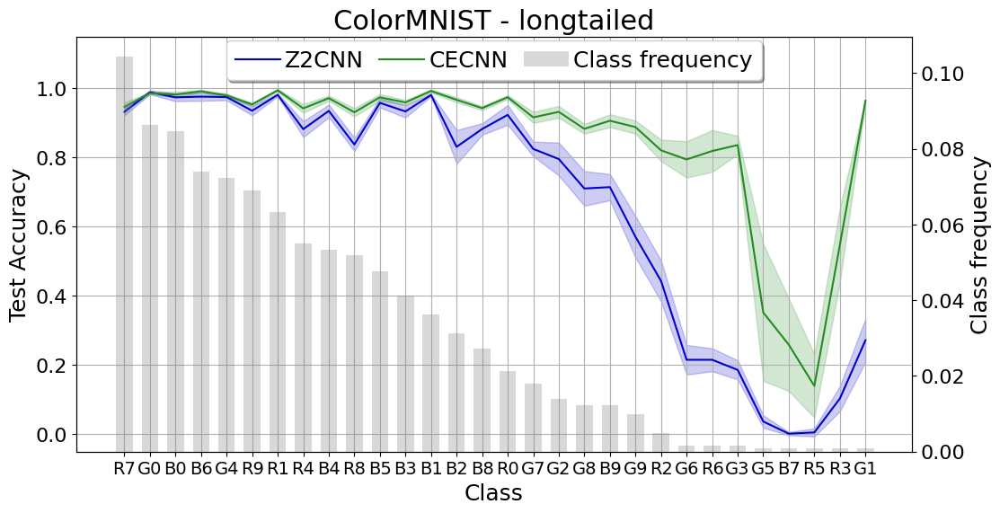 -->

  

  *Figure 1: ...*

The figure is ordered in the availability of training samples for every class. Performance of the shape-sharing CECNN consistently outperforms the baseline Z2CNN, where the average performance of the Z2CNN is 68.8% $\pm$ 0.6% and for the CECNN is 85.2 $\pm$ 1.2%. Most performance increase is seen in classes where little training data is provided thus confirming the hypothesis that the CECNN is able to share shape weight information effectively. These results are in line with the findings of the original authors which also describe a large performance increase. A difference in findings is the std of the CECNN which is larger than that of the Z2CNN however, this could be due to the randomness in data generation* which resulted in a different data distribution for our experiment.

* We made the data generation deterministic by setting a seed, and recreating our experiment would return the same data distribution.

#### Color Selectivity
<!---
TODO: in which stages is color equivariance useful (figure 3 about color selective datasets)
--->
Color selectivity is defined as: “The property of a neuron that activates highly when a particular color appears in the input image and, in contrast, shows low activation when this color is not present.” \[color_selectivity\]. The authors of the original paper utilize this notion to define the color selectivity of a dataset. Namely, they computed the color selectivity as an average of all neurons in the baseline CNN trained on the respective dataset. We reproduced the experiment to investigate the influence of using color equivariance up to late stages. Due to computational constraints, only two of the four datasets were explored; flowers102 with the highest color selectivity (0.70) and STL10 with the lowest color selectivity (0.38). While we did not explore the remaining datasets extensively, their color selectivity was comparable to STL10, suggesting that our findings are inclusive for the additional datasets.

In Figure 2, the accuracy improvement of color equivariance up to later stages in the network is displayed for both mentioned datasets. The baseline is the ResNet18 model with one rotation (equivariance up to 0 stages). For the other values, HybridResNet18 models are trained with 3 rotations, max pooling, separable kernels, and the number of color equivariant stages as shown in the figure. Additionally, the graph on the right shows the result with color-jitter augmentation.

<!-- 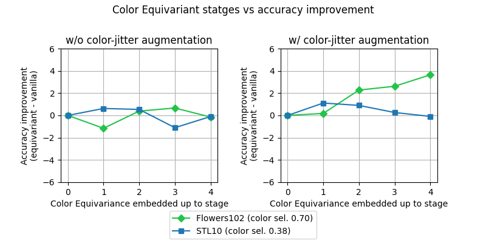 -->

  

  *Figure 2: Influence of color equivariance embedded up to late stages in the network on datasets with high and low color selectivity.*

Similar to the original paper’s results, the color-selective dataset seems to benefit from color equivariance up to later stages in the network, in contrast to the less color-selective dataset. This is especially clear for the graph with color-jitter augmentation. However, the color selectivity seems detrimental at the earlier stages without color-jitter augmentation for the color-selective dataset. In general, the accuracy improvements/deteriorations are less extreme compared to the original results. The differences might be explained by the fact that we trained the model on the full datasets instead of on a subset. By our results, we suspect that color equivariance is solely significantly beneficial for color-selective datasets in combination with color-jitter augmentation. Otherwise, the differences are negligible. 

### Color Equivariance in Image Classification and impact of hyperparameters

We will now explore the reproduction of a variation on the main results along with a small insight into the hyperparameters. These results are all limited to the Flowers102 dataset since it has the largest color discrepancy and the ResNet18 model, aligning with the original paper. The results were placed in the appendix of the original paper. However, we decided that the reproduction of the figure on one dataset is more insightful than an enormous table. The final experiment is an ablation study investigating the impact of varying the number of rotations. This aspect is altered across different experiments, highlighting its importance and deserving notice.

#### Image Classification

In our evaluation of image classification performance, we utilized the flowers-102 dataset due to its most prominent color dependency across the datasets evaluated by the original authors. Our study involved training a baseline ResNet-18 model comprising approximately 11,390,000 parameters, alongside the novel color equivariant CE-ResNet trained with three rotations. Both models underwent training with and without jitter, augmenting the training data with varying hue-intensity images. Subsequently, we assessed their performance on test sets subjected to gradual hue shifts ranging from -180° to 180°.

<!-- 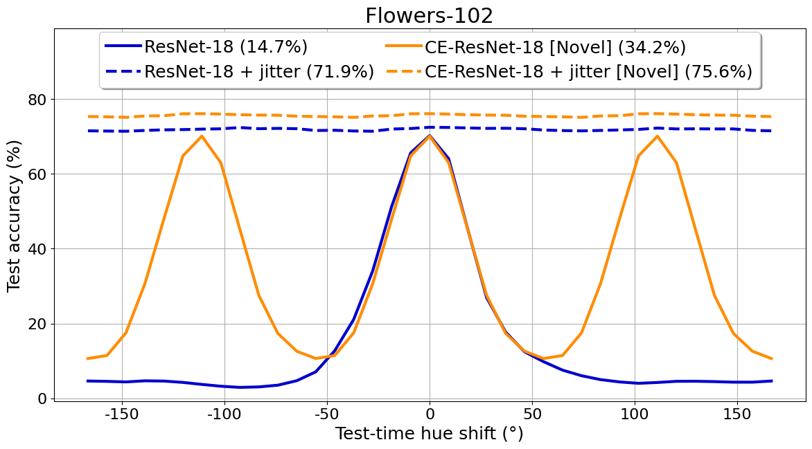 -->

  

  *Figure 3: ...*

In the figure presented, both the baseline ResNet and the CE-ResNet demonstrate good performance when no hue shift is applied (Test-time hue shift = 0). The CE-ResNet displays optimal performance in three specific hue areas, which reflects the orientations it is trained on. Moreover, the CE-ResNet consistently maintains performance levels above or equal to the original ResNet across almost all hue shifts, indicating its dominance across distributional changes.

When trained with jitter, both models exhibit robustness against distributional shifts, in line with the original author's findings, with the CE-ResNet-18 showing slightly better performance. This advantage is attributed to more efficiency in weight sharing, entailing more information can possibly be stored about other features. These models did take around 6 times as long to train than the non-jittered models. The extended training duration of these models can be attributed to the convoluted sampling process involved in generating jittered images.

Comparing training and testing times, the baseline model completes its training approximately 50% faster than the CEConv model. Testing time took around 2.3 times as long for the novel CEConv model. This indicates a significant speed advantage for production with the baseline model, albeit with a slight sacrifice in performance due to the non-utilization of CEConv.

#### Number of Rotations

<!---
TODO: the impact of the number of hue rotations (figure 13)
--->
The main implementation of the color-equivariance consists of adding three rotations of 120 degrees and the baseline model (not-equivariant) can be expressed as having 1 rotation. In Figure 4, we reproduced the experiments examining what happens with additional rotations. In order to save computational power, we limited the experiments to 1, 5, and 10 rotations (instead of 1-10 in the original paper). Nonetheless, the trends are the same.

  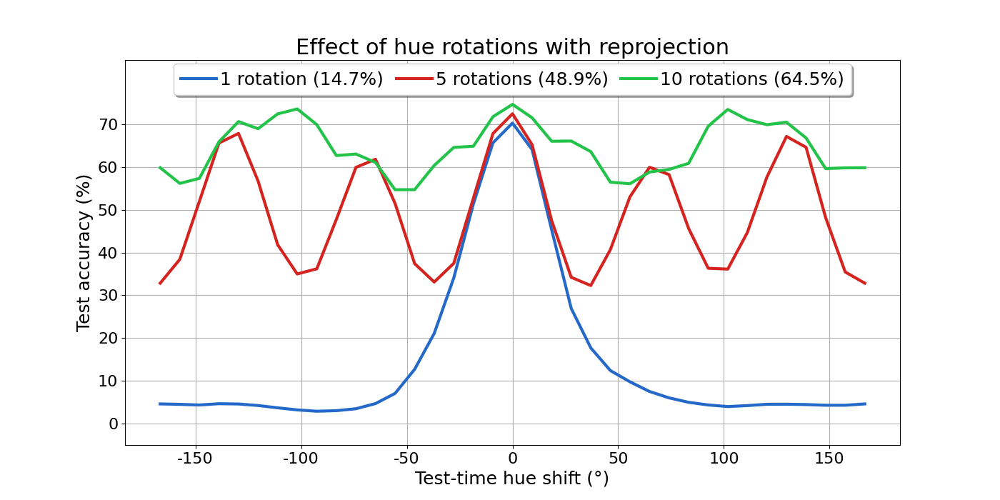

  *Figure 4: Accuracy with varying rotations.*

The lines in the plot are not smooth because it has only been evaluated on 37 points. Nonetheless, the trends are similar to the original paper’s findings. The number of peaks aligns with the number of rotations additionally, the height of the peaks decreases as the number of rotations increases. However, the peaks have different heights which might be attributed to the reprojection into the RGB cube range. Based on these results it seems that more rotations lead to higher equivariance. These results lead to a trade-off between the amount of equivariance, the maximum accuracy, and the number of parameters as displayed in Table 1.

| Number of Rotations        | Number of Parameters     | Max. Accuracy    |
|--------------|-----------|-----------|
| 1 | 11.2 M  | 70.3%  |
| 5 | 11.6 M  | 72.4%  |
| 10 | 11.8 M  | 74.6%  |

*Table 1: Parameter and maximum accuracy increase based on number of rotations.*

#### Jitter

## Further Research

The reproduced results showcase that the notion of equivariance can be extended to photometric transformations by incorporating parameter sharing over hue shifts. 
However, as opposed to what the title of the paper suggests, these networks are only equivariant to hue shifts and not fully color equivariant. We therefore set out to explore if we can move one step closer to achieving a fully color equivariant CNN by adding saturation or value shift equivariance in addition to hue shift equivariance. In order to disentangle these channels, we experiment with switching from the RGB color space to the HSV color space.
Firstly, we investigate if the effect of modeling hue shifts in the HSV color space achieves similar results. Secondly, we look into modeling saturation and value shifts to achieve equivariance to these respective channels and investigate their results individually. Lastly, we take a combination between the different channels to explore whether the network's performance will see a boost when being equivariant to a greater variety of changes in illumination due the the combination of hue and saturation or value shifts.

Additionally, one noticeable flaw in the work of [main] is the fact that they model hue shifts with a 3D rotation in the RGB space along the diagonal vector [1,1,1]. This can cause pixels with values close to the boundaries of the RGB cube to fall outside the RGB cube when rotated for certain hue shifts. In order to stay within the RGB space, these pixels have to be reprojected back into the RGB cube, effectively clipping the values. This causes the artifacts that can be seen in Figure 4, where training the CECNN for an increasing number of hue rotations causes the peaks, corresponding to the discrete trained hue shifts, to not be of equal height due to these clipping effects near the boundaries of the RGB cube.
We explore if we can circumvent these limitations by modeling the hue shift as a 2D rotation instead in the LAB color space.

### Color Spaces

While most CNNs are trained using RGB images, work by [color_net] and [color_segmentation] shows that different color spaces can be utilized to achieve similar performance for the task of image classification and segmentation respectively. 

**RGB** - is the most frequently used color space in image datasets. Moreover, it is also the dominant format for most digital images and as such comes with a host of libraries and functions that work upon images presented in this color space.
However, due to the red, green, and blue channels all contributing to the hue of an image, a 3D rotation is required in order to perform a hue shift. This 3D rotation has to be performed along the [1,1,1] axis of the color space in order to achieve a pure hue rotation in this space but comes with the disadvantage of the above-mentioned clipping effects near the boundaries of the RGB cube. 
Furthermore, due to these entangled color channels, it’s much harder to achieve a saturation or value shift in this color space when compared to other color spaces that encode the hue and saturation/value/lightness channels separately.

   
&nbsp; &nbsp; &nbsp; &nbsp;
  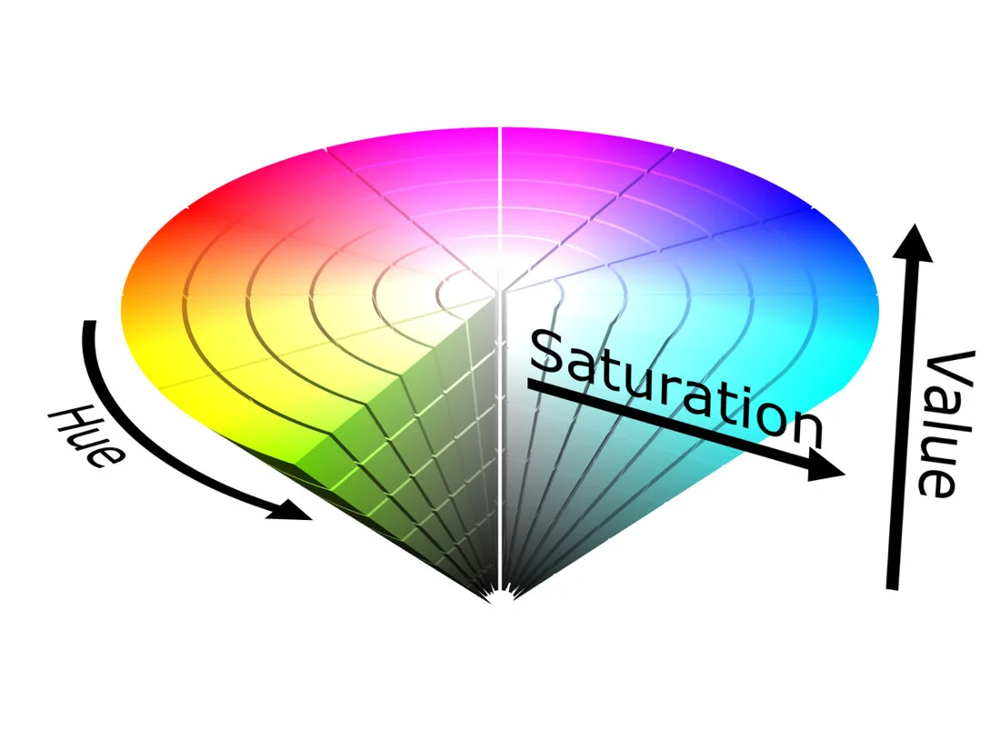
  

  *Figure D: The left figure displays the RGB color space as a cube where the rotational axis (Rot-Axis [1,1,1]) along which hue rotations are modelled in this space is also illustrated. The right figure showcases a visualization of the HSV color space in which the hue is modelled as an rotational angle between zero and two pi, while the saturation and value are modelled as translations on the interval of zero to one.* 
  

**HSV** - is an ideal color space for our purpose of extending the achieved hue equivariant CNN with saturation equivariance. With a separate channel encoding the hue of each pixel, we can make a direct comparison to the methods employed by [main] in order to perform hue shifts in the RGB color space. Additionally, the separate saturation and value channels allow us to experiment if equivariance to saturation or value shifts are beneficial for the task of image classification.
However, there are some potential issues with this color space. Firstly, there is the concern about the discontinuity in the hue channel. Here the fact that the hue channel, in our implementation, is encoded as an angle ranging from $0$ to $2 \pi$ could pose learning issues for a network. This is because the values of $0$ and $2 \pi$ are as far apart as possible for an HSV image but these values encode the same color, since the color space effectively loops around from $2\pi$ back to $0$ in a circular manner. Secondly, there is the fact that the saturation and value channels are not cyclic and lie within a $[0,1]$ interval. Therefore, when shifting these channels we would need to clip shifts that fall outside this interval, causing a loss of information. Lastly, it is not straightforward how to transform a kernel under the regular representation of the group elements for either the group of hue rotations, or saturation and value translations, in order to perform the lifting convolution.

**LAB** - is a color space defined by the International Commission on Illumination (CIE) in 1976. Research by [color_net] and [color_segmentation] shows that images converted to LAB color space achieve around a two percentage point higher score on classifications and segmentation tasks as compared to other color models. The LAB model closely aligns with human vision encoding an image using three channels, the *L* channel encodes the perceptual lightness while *a* and *b* encode the color as a point on a 2D grid with the *a* axis modeling the red-green shift and *b* the yellow-blue shift corresponding to the four unique colors of human vision. Figure 5 shows this 2D grid in which a hue space shift can be modeled as a 2D rotation on this plane, suggesting that the full-color space has a cylindrical form. However, when visualizing the RGB gamut inside the 3D LAB space, on the right, it doesn't show this cylinder. This is a result of the nonlinear relations between *L*, *a*, and *b* intended to model the nonlinear response of the visual system, which is absent in the RGB color model.     

  

  *Figure 5: left: LAB color space visualized as a 2d color grid, right: sRGB color gamut shown in LAB space. ([source](https://www.xrite.com/blog/lab-color-space), [source](https://blogs.mathworks.com/steve/2015/04/03/displaying-a-color-gamut-surface/))*

Hue equivariance in LAB space would require a rotation matrix however due to the problems with converting between RGB/HSV as outlined below it could be difficult for a hue equivariant model trained on LAB space hue equivariance to also become equivariant to hue space shifted images in RGB/HSV format which are thereafter converted to LAB format.

  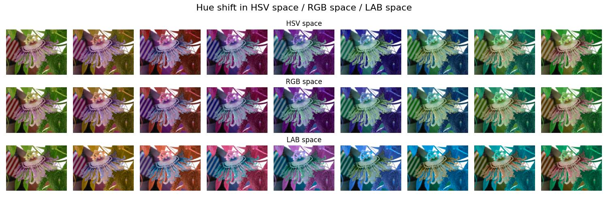

  *Figure 6: An example image (original far left) hue space shited multiple times in HSV (angular addition), RGB (3D rotation), and LAB (2D rotation) space, thereafter converted to RGB space for visualization. ([source](CEConv/plot_hue_comparison.py))*

Figure 6 clearly shows this difference with an image hue space shifted in RGB and HSV space resulting in the same image however performing the same shift in LAB space and thereafter converting back to RGB space results in a slightly different colored image.

### Methodology
This section will explain the implementation of color equivariance networks in the HSV and LAB color space. Just like the original paper the implementation of the lifting layer and the group convolution will be discussed this layer can then replace the standard convolution layers in different architectures like ResNet, in which the width is reduced resulting in a network with equivariant layers but with the same number of parameters.

#### HSV
**Shifting the Kernel -** In our implementation of the HSV space, **hue** is modeled as an angular value between zero and two pi and can be changed by adding or subtracting such an angle modulo two pi. Therefore, we represent the group $H_n$ as a set of $\frac{2\pi}{n}$ rotations: $H_n = \\{ \frac{2\pi}{n} k | k \in \mathbb{Z}, 0 \leq k \lneq n \\} $. In HSV space this can parameterized as the vector: 

$$
H_n(k) = \\begin{bmatrix} \frac{2\pi}{n} k \\\\ 0 \\\\ 0 \\end{bmatrix} 
$$

In which n is the discrete number of rotations and k indicates the k-th rotation out of n. The group action is an addition on a HSV pixel value in $\mathbb{R}^3$ modulo $2\pi$:

$$
\[H_n(k)f\] (x) = \\begin{bmatrix} (f(x)_h + \frac{2\pi}{n} k) \\% 2\pi \\\\ f(x)_s \\\\ f(x)_v \\end{bmatrix}
$$

with $f(x)_{h,s,v}$ indicating the respective hue, saturation, or value at pixel value $x$ in the input image $f$. Because the Hue value is defined on a cyclic interval the dot product between a hue-shifted image ($f$) is the same as the dot product between an inverse hue-shifted filter ($\psi$), in contrast to the reproduced paper in which they model hue shifts as a 3D rotation meaning they can fall out of the RGB cube:

$$
\[H_n(k)f\] (x) \cdot \psi(y) = f(x) \cdot \[H_n(-k)\psi\](y)
$$

We can now define the group $G = \\mathbb{Z}^2 \\times H_n$ as the product of the 2D integers translation group and the HSV hue shift group. With the operator $\\lambda_{t, m}$ defining a translation and hue shift:

$$
\[\lambda_{t, m}f\](x) = \[H_n(m)f\](x-t) = \\begin{bmatrix} (f(x - t)_h + \frac{2\pi}{n} m) \\% 2\pi \\\\ f(x - t)_s \\\\ f(x - t)_v \\end{bmatrix}
$$

We can then define the lifting layer outputting the i-th output channel as:

$$
\[f \star\psi^i\](x, k) = \sum_{y \in \mathbb{Z}^2} f(y) \cdot \[H_n(k)\psi^i\](y-x)
$$

Here $f$ is the input image and $\psi^i$ a set of corresponding filters.
The equivariance can be shown as:

$$
\[\[\lambda_{t, m}f\]\star\psi^i\] (x, k) = \sum_{y \in \mathbb{Z}^2} \[H_n(m)f\](y-t) \cdot \[H_n(k)\psi^i\](y-x)
$$

$$
\[\[\lambda_{t, m}f\]\star\psi^i\](x, k) = \sum_{y \in \mathbb{Z}^2} f(y) \cdot \[H_n(k-m)\psi^i\](y-(x-t))
$$

$$
\[\[\lambda_{t, m}f\]\star\psi^i\](x, k) = \[f\star\psi^i\](x-t, k-m)
$$

$$
\[\[\lambda_{t, m}f\]\star\psi^i\](x, k) = \[\lambda'_{t, m}[f\star\psi^i\]\](x, k)
$$

Since the input HSV image is now lifted to the group space all subsequent features and filters are functions that need to be indexed using both a pixel location and a discrete rotation. The group convolution can then be defined as:

$$
\[f \star\psi^i\](x, k) = \sum_{y \in \mathbb{Z}^2} \sum_{r=1}^n f(y,r) \cdot \psi^i(y-x, (r-k)\%n)
$$

For **saturation** equivariance we need to redefine the group, because saturation is represented as a number between zero and one we need to create a group containing n elements equally spaced between minus and one to model both an increase and decrease in saturation. This makes all group elements fall in the set:
$H_n = \\{-1 +k\frac{2}{n-1} | n \geq 2, k = 0,1,2,...,n-1 \\}$. In HSV space this can parameterized as the vector: 

$$
H_n(k) = 
\begin{bmatrix} -1 +k\frac{2}{n-1} \\\\ 0 \\\\ 0 
\end{bmatrix} 
$$

Because saturation is only defined between 0 and 1 and is not cyclic we need to clip the value after the group action:

$$
\[H_n(k)f\](x) = 
\begin{bmatrix} f(x)_h \\\\ \text{clip}(0, f(x)_s + (-1 +k\frac{2}{n-1}), 1) \\\\ f(x)_v 
\end{bmatrix}
$$

This clipping due to the non-cyclic nature of saturation might break equivariance, which will be tested with several experiments, applying the group action on the kernel, the image and testing different values for n.

**Value** equivariance can be modelled in the same way as described for saturation the only thing different is that the group action now acts upon the value channel:

$$
\[H_n(k)f\](x) = \\begin{bmatrix} f(x)_h \\\\ f(x)_s \\\\ \text{clip}(0, f(x)_v + \frac{1}{n} k, 1) \\end{bmatrix}
$$

Due to our earlier experimenting with applying the group element on the kernel or the image we decided to now only model the value shift of the input images as described in the next paragraph.

**Shifting the Input Image -** In order to circumvent some of the issues that present themselves when naively shifting the kernel as though it were an image, we investigated whether we could perform the lifting convolution by shifting the input image instead of the kernel. This is a more intuitive approach and [lifting] show that transforming the signal instead of the kernel is indeed possible and that these operations are equivalent when restricted to the group and standard convolution. This then allows for more general transformations than when using the group correlation of [group_convs]. In our case, where we make use of the HSV color space with separated hue, saturation and value channels, this way of performing the lifting operation is required due to the fact that we perform our action on these separated channels. Transforming the signal instead of the kernel then allows us to alter the values of pixels instead of only moving the pixel locations.

We can thus define the lifting layer outputting the i-th output channels for our semigroup H of hue shifts as follows:

$$
\[\psi^i \star f\](\mathbf{x}, k) = \sum_{y \in \mathbb{Z}^2} \psi^i(y) \cdot H_n(k)\[f\](y-\mathbf{x})
$$

In a similar way we can create the lifting layer for the saturation and value groups.

**Combining Multiple Shifts -** Because of the separated channels when utilzing the HSV color space, we can describe the group product between multiple channel shifts as the direct product off these groups individually.

$$ 
G = \mathbb{Z}_2 \times C_n \times \mathbb{R} \times \mathbb{R} 
$$

Given an pixel in an image at location $x$:

$$ 
I(\mathbf{x}) = (h(\mathbf{x}), s(\mathbf{x}), v(\mathbf{x})) 
$$

We can then define the action of the combination of these groups acting on the image as:

$$ 
\mathcal{L}_{(\mathbf{x'},h',s',v')} \[ I \](\mathbf(x)) = (h' \cdot h(\mathbf{x} - \mathbf{x'}, \ s' \cdot s(\mathbf{x} - \mathbf{x'}), \ v' \cdot v(\mathbf{x} - \mathbf{x'}))
$$

#### LAB 
For the LAB space only a hue shift equivariant model is implemented, as stated before a hue shift in LAB space can be modeled as a 2D rotation on the *a* and *b* channels. For this, we can reuse almost all of the theory as explained in Section [Color Equivariance](#color-equivariance) with the only change being the parameterization of the group $H_n$ as 

$$ 
H_n = 
\begin{bmatrix}
1 & 0 & 0 \\
0 & \cos(\frac{2k\pi}{n}) & -\sin(\frac{2k\pi}{n}) \\
0 & \sin(\frac{2k\pi}{n}) & \cos (\frac{2k\pi}{n})\\
\end{bmatrix}
$$

In which $n$ represents the number of discrete rotations in the group and k indexing the rotation to be applied. The group operation now is a matrix multiplication on the $\mathbb{R}^3$ space of LAB pixel values. The rest of the operations can be left the same. Because we are rotating on a rectangular plane we can never fall out of the lab space thus there is again no need for reprojection. However, as stated before issues arise when converting from LAB to RGB and back.

### Experiments & Results
In order to test the effectiveness of our implementation several experiments were conducted. 
In these experiments, we aim to test our method on a real-world dataset (Flowers102) which is artificially shifted over a range of values on the property for which the network should be equivariant (hue/saturation/value). Equal to the setting in the section [Image Classification](#image-classification). Because equivariance is implemented on a discrete domain we expect to see peaks in network performance at the places in which the test time shift equals the shift in the group.

#### HSV

##### Hue Shift Equivariance
**Shifting the Kernel -** We have described some of the potential issues surrounding the HSV color space. While aware of these challenges, we initially set out to explore how the network would perform if we naively shifted the hue of the input layer filters. 
For this experiment, we took a ResNet-18 network and replaced the standard convolutional layers with our group convolutional layers. Here the first layer will perform the lifting convolution that maps our input image to the group and the later layers perform the corresponding group convolutions. The network is trained for 3 discrete hue rotation angles, namely 0°, 120°, and 240° (-120°), and for 200 epochs with a batchsize of 64.
We separate 2 cases where we train the potential equivariant network (CE-ResNet-18) with hue jitter, randomly applying a hue shift with a uniformly chosen hue factor between -0.5 and 0.5, and without any hue jitter. Additionally, for comparison we train 2 baseline models of a ResNet-18 network with and without hue jitter, where the width of the network is increased such that the number of parameters between the equivariant and baseline networks is equal.

We evaluate our models based on the classification accuracy on the Flowers-102 dataset, where we shift all test images with 37 discrete hue shifts to verify whether the performance of the CE-ResNet-18 networks excels beyond the baseline models.

  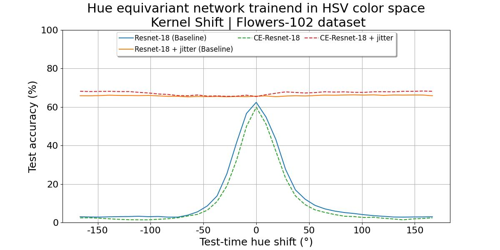

  *Figure X: Illustrates the test accuracy scores of a variaty of models evaluated with 37 Test-time hue shifts spanning the full range of -180° to 180° hue rotations. The CE-ResNet-18 models are trained for 3 discrete hue rotations of 0°, 120° and 240° applied to the kernel during the lifting convolution. The baseline models are standard ResNet-18 CNNs without any group convolutional layers. ([source](CEConv/plot_fig9_hue.py))* 

As expected, naively shifting the kernel does not work. In Fig X, there is a clear peak for both the CE-ResNet-18 and corresponding baseline model at the 0° hue shift angle (thus no shift is performed). The further the hue is shifted from the image’s original values, the worse the performance of these models becomes. Additionally, it can be seen that when training with a hue jitter data augmentation, the ResNet model is expressive enough to perform robustly over the entire hue spectrum. However, the performance of the CE-ResNet-18 still does not excel over its baseline counterpart.
The fact that this approach does not achieve hue shift equivariance is due to the fact that we cannot simply utilize and hue shift this kernel as though it were an image. This brings a host of inconsistencies with it, for example, applying the hue shift on the weights directly acts more as an added bias than a rotation of the hue. Moreover, weights that are negative get mapped to a relatively high positive hue value after applying the modulus operation rather than a low one. This also breaks the condition that, all groups must satisfy: where for each element of the group there should exist an inverse of this element which retrieves the identity element. This is not true as per the modulus operation when applied to the negative values in a kernel, we can never retrieve the negative values by applying the inverse of the action. Thus, while it was an interesting experiment for the HSV space this approach has no merits.

**Shifting the Input Image -** The next experiment takes a different approach. Instead of naively hue shifting the kernel we now peform the lifting convolution by shifting the input image effectively creating an hue shifted image stack. Thus we transform the signal rather then the kernel. The experimental setup is kept identical to the previous experiment.

  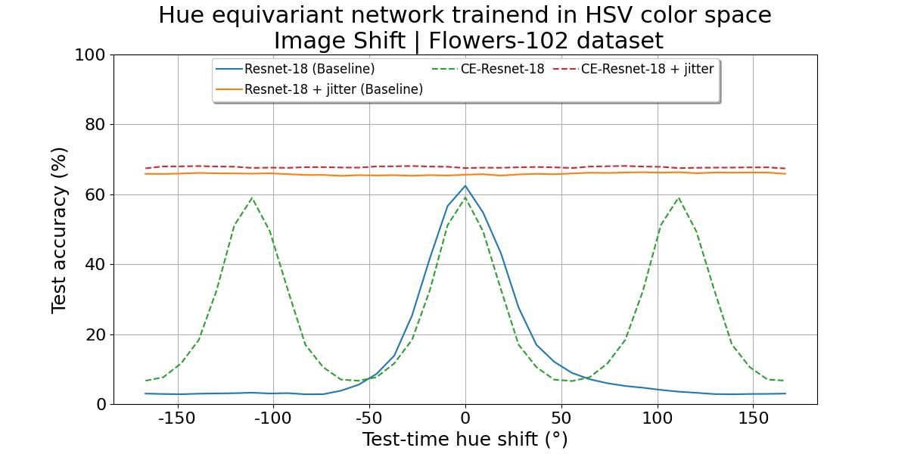

  *Figure XX: Illustrates the test accuracy scores of a variaty of models evaluated with 37 Test-time hue shifts spanning the full range of -180° to 180° hue rotations. The CE-ResNet-18 models are trained for 3 discrete hue rotations of 0°, 120° and 240° applied to the input image during the lifting convolution. The baseline models are standard ResNet-18 CNNs without any group convolutional layers. ([source](CEConv/plot_fig9_hue.py))*  

As can be seen in Fig XX, for this experiment the CE-ResNet-18 network shows 3 clear peaks at the 0°, 120°, and 240° (-120°) hue rotation angles. The network is able to exploit its hue shift equivariance to perform at an equal level across all 3 discrete hue rotations, whereas the baseline model is not. However, since we only train the network for 3 discrete rotations, we can still see that when training with hue jitter both the baseline and CE-ResNet-18 achieve better, more robust performances. If trained for more discrete rotations this difference can be negated but this comes at the cost of an increase in parameters for the CE-ResNet or a severe decrease in network width if trained such that the number of parameters is kept equal to that of the baseline model.
Similarly, the ever-so-slight decrease in performance on the top-end of the CE-ResNet-18 model without jitter compared to its baseline can be explained by this trade-off. In our test, we try to keep the amount of parameters equal between the baseline models and the hue shift equivariant models, at around 11.2M parameters. In order to do this we must thus reduce the width of the CE-ResNet-18 model as making the model equivariant comes at the cost of an increased amount of parameters. Due to this reduction in width, the CE-ResNet-18 model is less expressive than its baseline counterparts explaining the slight decrease in peak performance when the hue is not shifted at test time (0° hue shift).

##### Saturation Equivariance
**Shifting the Kernel -** This experiment largely follows the setup from the hue equivariant network in HSV space. However, 5 saturation shifts are applied on the kernel as to not only obtain images that are in black and white or have maximum saturation. Furthermore, 50 saturation shifts were applied to the test dataset in order to measure performance. Finally, jitter in this case implies saturation jitter, which was applied during training.

  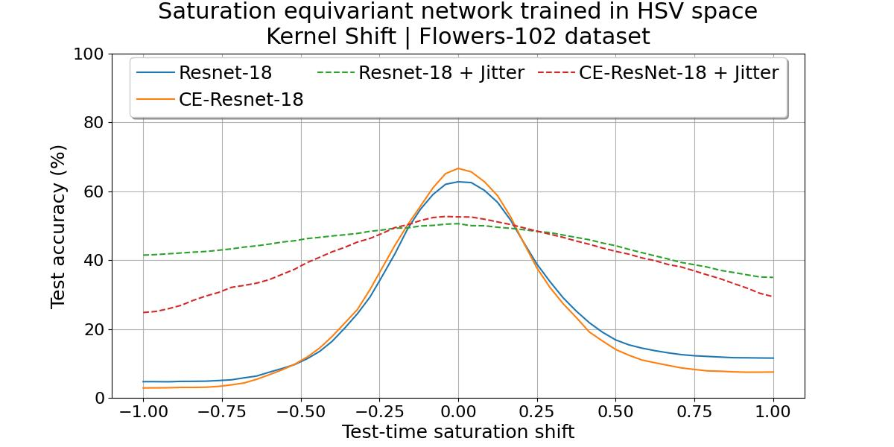
  
  *Figure XX: Accuracy over test-time saturation shift for saturation equivariant networks trained using input images in HSV color space format. Resnet-18 indicates a baseline model, CE indicates Color (saturation) Equivariant networks, and jitter indicates training time saturation augmentation, which was set to be in [0, 100]. The CE-Resnet-18 models are trained for 5 discrete saturation translations of -1, -0.5, 0, 0.5 and 1. ([source](CEConv/plot_saturation.py))*  

In the above figure, we find that when the image's saturation is not adjusted, the CE-ResNet-18 outperforms the baseline. However, for higher and lower saturation shifts, the baseline tends to outperform it. This means the CE-ResNet-18 was unable to obtain saturation equivariance, which could be due to the clipping. Moreover, the same trends also appear for when jitter is added. The difference between the two models is also more significant towards the ends of the plot. It does appear that jitter helps both models in becoming robuster to saturation changes, as the model has seen varying saturations during training.

**Shifting the Input Image -** In this next approach, the input signal was transformed instead, akin to the hue equivariant one. However, the aforementioned settings for saturation shifts are utilised. 

  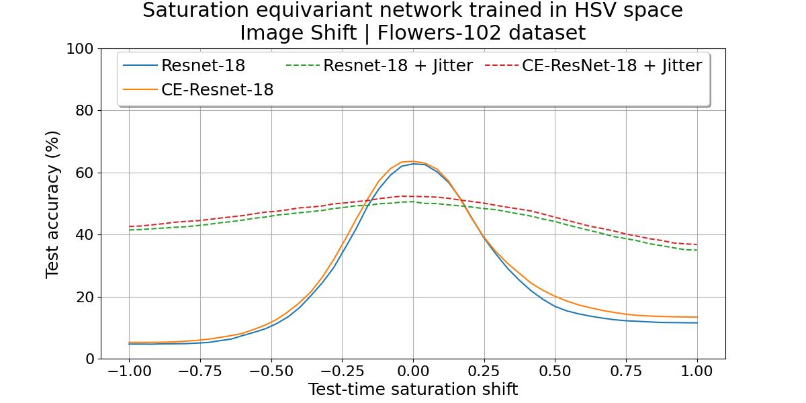
  
  *Figure XX: Accuracy over test-time saturation shift for saturation equivariant networks trained using input images in HSV color space format. Resnet-18 indicates a baseline model, CE indicates Color (saturation) Equivariant networks, and jitter indicates training time saturation augmentation, which was set to be in [0, 100]. The CE-Resnet-18 models are trained for 5 discrete saturation translations of -1, -0.5, 0, 0.5 and 1 that were applied to the input image. ([source](CEConv/plot_saturation.py))*  

... #TODO

##### Value Equivariance
For value equivariance, we only tested shifting the input images with 5 shifts. Initially, we tested with a shift range starting at minus one however in RGB space this results in totally black images with a complete loss of information, therefore, we decided to replace this minus one with minus a half. The results can be found in Figure 8/

  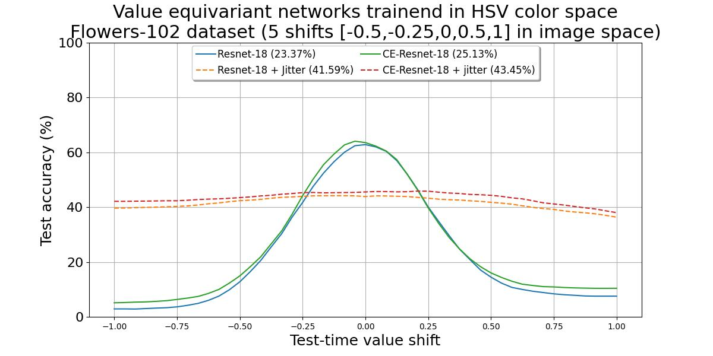

  *Figure 8: Accuracy over test-time value shift for hue equivariant networks trained using input images in HSV color space format. Resnet-18 indicates a baseline model, CE indicates Color (value) Equivariant networks, and jitter indicates training time hue augmentation. The mean per model over all test-time value shifts is indicated in the legend. ([source](CEConv/plot_fig9_value.py))* 

While being trained with 5 different shifts the model is not able to show this equivariance and follow the performance of the baseline Resnet-18. Training with jitter increases performance at the extremes of the shifted images but decreases performance around the original non-shifted images.

#### LAB
To test hue equivariance implemented in LAB space the convolution layers of a ResNet-18 network were replaced by their equivariant counterpart. The equivariant layers are implemented using three discrete shifts of 0, 120, and 240 (-120) degrees. The network is trained with and without hue augmentations (jitter) on training images. The same can be said for the baseline which has the same Resnet-18 architecture, however now with only a zero-degree rotation making it equal to a normal CNN. The width of these layers is increased to get an equal number of parameters.

During test time different sets of hue space-shifted images are evaluated on accuracy. This hue space shift is either done in RGB space after which the RGB images are converted to LAB format, or directly in LAB space to test the impact of the difference outlined in the [color space](#color-spaces) section. The results of these experiments can be found in Figure 9

  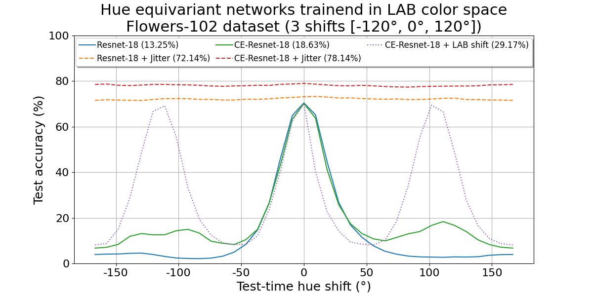

  *Figure 9: Accuracy over test-time hue angle shift for hue equivariant networks trained using input images in LAB color space format. Resnet-18 indicates a baseline model, CE indicates Color (hue) Equivariant networks, jitter indicates training time hue augmentation, and LAB shift indicates test-time hue shift is performed in LAB space instead of HSV/RGB space. The mean per model over all test-time hue shifts is indicated in the legend. ([source](CEConv/plot_fig9_lab.py))* 

Figure 9 shows some interesting observations. To start the Resnet-18 baseline only shows a peak around images that are not hue-shifted (zero degrees). The hue equivariant network (CE) tested with hue space shifts in RGB/HSV space shows small bumps around ±120° but still exhibits terrible performance. On the other hand, the same CE model evaluated with Hue space shift applied in LAB space shows performance equal to the baseline also around ±120°, meaning the model is LAB space Hue shift equivariant. This also means that there is a too-large gap between Hue space shifts in LAB space compared to RGB/HSV space and the model isn't able to generalize to RGB/HSV space.

Analyzing the jitter results shows that training with augmentations can be a way to implicitly encode equivariance into a network. The baseline Resnet-18 model outperforms all non-jitter models' overall hue angles. Interestingly when training the CE-Resnet with jitter we can see a significant jump in performance over the baseline jitter model, on average gaining six percentage points. Getting the highest accuracy over all models, outperforming the reproduced CE-Resnet-18 + jitter model which only gains about four percentage points compared to the RGB baseline+jitter which has similar performance to the LAB baseline+jitter model. This indicates that first of all training with jitter and an equivariant model combines the best of both worlds and results in a robust model, and that training in LAB space can indeed lead to a small performance increase in line with the findings of [color_net] and [color_segmentation]. 

## Concluding Remarks

#TODO

## Authors' Contributions

#TODO

## References
<a id="1">[bird]</a> 
Simen Hagen, Quoc C. Vuong, Lisa S. Scott, Tim Curran, James W. Tanaka; The role of color in expert object recognition. Journal of Vision 2014;14(9):9. https://doi.org/10.1167/14.9.9.

<a id="1">[human_vision]</a> 
Ivet Rafegas, Maria Vanrell; Proceedings of the IEEE International Conference on Computer Vision (ICCV), 2017, pp. 2697-2705 

<a id="1">[color_invariance]</a> 
R. Rama Varior, G. Wang, J. Lu and T. Liu, "Learning Invariant Color Features for Person Reidentification," in IEEE Transactions on Image Processing, vol. 25, no. 7, pp. 3395-3410, July 2016, doi: 10.1109/TIP.2016.2531280.
keywords: {Image color analysis;Lighting;Cameras;Histograms;Shape;Dictionaries;Robustness;Person re-identification;Illumination invariance;Photometric invariance;Color features;Joint learning;Person re-identification;illumination invariance;photometric invariance;color features;joint learning},

<a id="1">[DCNN]</a>
W. Rawat and Z. Wang, "Deep Convolutional Neural Networks for Image Classification: A Comprehensive Review," in Neural Computation, vol. 29, no. 9, pp. 2352-2449, Sept. 2017, doi: 10.1162/neco_a_00990. 

<a id="1">[group_convs]</a>
Cohen, T. &amp; Welling, M.. (2016). Group Equivariant Convolutional Networks. <i>Proceedings of The 33rd International Conference on Machine Learning</i>, in <i>Proceedings of Machine Learning Research</i> 48:2990-2999 Available from https://proceedings.mlr.press/v48/cohenc16.html.

<a id="1">[main]</a>
Lengyel, A., Strafforello, O., Bruintjes, R. J., Gielisse, A., & van Gemert, J. (2024). Color Equivariant Convolutional Networks. Advances in Neural Information Processing Systems, 36.

<a id="1">[color_selectivity]</a>
Ivet Rafegas and Maria Vanrell. Color encoding in biologically-inspired convolutional neural  networks. Vision Research, 151:7–17, 2018. Color: cone opponency and beyond.

<a id="1">[color_net]</a>
Gowda, S. N., & Yuan, C. (2019). ColorNet: Investigating the importance of color spaces for image classification. In Computer Vision–ACCV 2018: 14th Asian Conference on Computer Vision, Perth, Australia, December 2–6, 2018, Revised Selected Papers, Part IV 14 (pp. 581-596). Springer International Publishing.

<a id="1">[color_segmentation]</a>
Raninen, J. (2022). The Effect of Colour Space in Deep Multitask Learning Neural Networks for Road Segmentation (Master's thesis, Itä-Suomen yliopisto).

<a id="1">[lifting]</a>
Worrall, D., & Welling, M. (2019). Deep scale-spaces: Equivariance over scale. Advances in Neural Information Processing Systems, 32.

## Appendix
### A. Combining Hue and Shift Equivariance
As outlined in the [methodology](#methodology), it is possible to model hue and saturation equivariance jointly. A model was trained to encode both of these shifts on the kernel and on the input image.

..

From the above figure, it can be seen that the model does not improve its performance when using both equivariances. Namely, per axis the same trends and numbers are visible as when the model was trained with that respective equivariance only. 

..

In the above plot we again reach the same conclusion that utilising both equivariances does not yield a significant improvement. Because these results were not promising and computationally heavier due to the combined number of hue and saturation shifts, we decided to not further pursue this direction.

