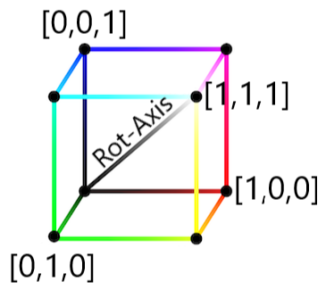

# A deep dive into color space equivariant networks

**Authors:** *S.R. Abbring, H.C. van den Bos, R. den Braber, A.J. van Breda, D. Zegveld*

---

In this blog post, we discuss, analyze, and extend upon the findings of the paper titled *Color Equivariant Convolutional Networks* [[5]](#main). The paper introduces Color Equivariant Convolutions (CEConvs) that leverage parameter sharing over hue shifts. The authors demonstrate the benefits of the novel model in terms of robustness to color alterations and classification accuracy when confronted with test-time hue shifts.
The objectives of this blog post are to:

1. Discuss the methods introduced in the paper
1. Verify the authors' claims
1. Extend the notion of color equivariance to other dimensions beyond hue by leveraging different color spaces than RGB

---

## Introduction

Color is a crucial feature in how people identify and recognize objects. For example, a study by [[8]](#bird) found that color facilitates expert bird watchers in faster and more accurate recognition at both high (family) and low (specimen) levels of bird identification. Similarly, the convolutional layers in a Convolutional Neural Network (CNN) exhibit color representation akin to the human visual system [[4]](#human_vision) with all layers containing color-selective neurons. These color representations are present at three different levels: in single neurons, in double neurons for edge detection, and in combination with shapes at all levels in the network.

Although color invariance has been achieved in various research areas, such as in facial recognition to mitigate the influence of lighting conditions [[7]](#color_invariance), some classification problems are color-dependent. Therefore, instead of training CNNs to classify images regardless of their color (invariance), it might be more beneficial to classify them using a color equivariant network. 

The Color Equivariant Convolutions (CEConvs) introduced in [[5]](#main) achieve equivariance to discrete hue shifts. Hue is represented in RGB space as a 3D rotation around the [1, 1, 1] axis. This approach utilizes group convolutions as proposed by [[1]](#group_convs) which can be equivariant to 3D rotations. We reproduce the results showing the effectiveness of CEConvs on color-imbalanced and color-selective datasets, as well as their impact on image classification. We examine an ablation study to understand the impact of the number of discrete hue rotations on CEConvs, while also providing additional insights into the computational requirements. Finally, we extend the notion of color equivariance to different color spaces to overcome some limitations of the CEConvs.

## Recap on Group Equivariant Convolutions

Deep Convolutional Neural Networks have been proven to be highly effective for image classification [[10]](#DCNN). Empirical evidence shows the importance of depth for good performance and convolutional weight-sharing for parameter reduction. The latter is effective due to the translation symmetry inherent in most image data, whereby the data is roughly invariant to shifts. In this manner, the same weights can be utilized to convolve different parts of the image [[1]](#group_convs). 
As a result, the convolutional layers in a deep network are translation equivariant: the output shifts relative to shifts in the input. 

Translation equivariance can be extended to larger groups, including rotation. This generalization is achieved through Group Convolutional Neural Networks (G-CNN). A CNN layer is equivariant to a group if transforming the input $x$ by transformation $g \in G$ ($T_g$) followed by the feature mapping $\Phi$ is similar to doing the feature mapping on the input and the transformation $T'_g$ thereafter: 

$$\begin{align*} 
\Phi (T_g x) = T'_g \Phi (x) & \qquad \qquad \forall g \in G, \\
\end{align*}
\tag{1}$$

where $T_g$ and $T'_g$ can be equivalent.
We utilize the equations from [[1]](#group_convs) to show that G-CNNs are equivariant. Instead of shifting a filter, correlation in the first layer can be described more generally by replacing it with some transformation from group $G$, whereby $f$ is the input image and $\psi$ is the filter:

$$\begin{align*} 
\[ f \star \psi \](g) = \sum_{y \in \mathbb{Z}^2}\sum_{k} f_k(y) \psi_{k}(g^{-1}y) \\
\end{align*}
\tag{2}$$

Since the feature map $f \star \psi$ is a function on G, the filters are functions on G for all layers after the first. The correlation then becomes:

$$\begin{align} 
\[ f \star \psi \](g) = \sum_{h \in G}\sum_{k}f_k(h)\psi_{k}(g^{-1}h)\\ 
\end{align}
\tag{3}$$

We define the left regular representation, whereby the group is acting on the transitive input space of the function $f: X \rightarrow Y$:

$$\begin{align} 
\[ L_g f \](x) = \[ f \circ g^{-1} \](x) = f(g^{-1}x)
\end{align} 
\tag{4}$$

Using this representation and the substitution $h \rightarrow uh$, the equivariance of the correlation can be derived such that a translation followed by a correlation is equivalent to a correlation followed by a translation:

$$\begin{align} 
\[\[L_uf\] \star \psi\](g) &= \sum_{h \in G}\sum_k f_k(u^{-1}h)\psi(g^{-1}h)\\ 
&= \sum_{h \in G}\sum_kf(h)\psi(g^{-1}uh)\\
&= \sum_{h \in G}\sum_kf(h)\psi((u^{-1}g)^{-1}h)\\
&= \[L_u\[f \star \psi\]\](g)\\
\end{align}
\tag{5}$$

## Color Equivariance

The original paper exploits the concept of group equivariant convolutions to achieve color equivariance, defined as equivariance to hue shifts. In the HSV (Hue-Saturation-Value) color space, hue is represented as an angular scalar value between $0$ and $2\pi$. The hue value can be shifted by adding an offset after which the modulo $2\pi$ is taken to ensure a valid range. When converting this process to the RGB space a hue shift corresponds to a rotation along the diagonal vector [1, 1, 1]. 

This definition is extended to group theory, by defining the group $H_n$ as a subgroup of the $SO(3)$ group. Specifically, $H_n$ consists of multiples of $\frac{360}{n}$-degree rotations along the [1, 1, 1] diagonal vector in $\mathbb{R}^3$ space. 

This leads to the following parameterization of $H_n$, with $n$ identifying the total number of discrete rotations, $k$ encoding a specific rotation, $a = \frac{1}{3} - \frac{1}{3}\cos (\frac{2k\pi}{n})$ and $b = \sqrt{\frac{1}{3}} \cdot \sin (\frac{2k\pi}{n})$:

$$ 
H_n = 
\begin{bmatrix}
\cos (\frac{2k\pi}{n}) + a & a - b & a + b \\
a + b & \cos (\frac{2k\pi}{n}) + a & a - b \\
a - b & a + b & \cos (\frac{2k\pi}{n}) + a \\
\end{bmatrix}
\tag{6}
$$

The group of discrete hue shifts is combined with the group of discrete 2D translations into the group $G = \mathbb{Z}^2 \times H_n$. The Color Equivariant Convolution (CEConv) in the first layer is defined in [[5]](#main) as:

$$
\begin{align} 
\[f \star \psi^i\](x, k) = \sum_{y \in \mathbb{Z}^2}\sum_{c=1}^{C^l}f_c(y) \cdot H_n(k)\psi_c^i(y - x)\\ 
\end{align}
\tag{7}
$$

However, a small error is present here as the sum $\sum\limits_{c=1}^{C^l}$ indicates that $f_c(y)$ and $\psi_c^i(y - x)$ are scalar values. This interpretation is inconsistent given the dot product and the matrix $H_n(k)$.
Therefore the correct formula should be:

$$
\begin{align} 
\[f \star \psi^i\](x, k) = \sum_{y \in \mathbb{Z}^2}f(y) \cdot H_n(k)\psi^i(y - x)\\ 
\end{align}
\tag{8}
$$

However, this change does not impact the derivation of the equivariance of the CEConv layer, as given in the original paper [[5]](#main).

For the hidden layers, the feature map $[f \star \psi]$ is a function on $G$ parameterized by $x$ and $k$. The CEConv hidden layers formula then becomes:

$$\begin{align} 
\[f \star \psi^i\](x, k) = \sum_{y \in \mathbb{Z}^2}\sum_{r=1}^n f(y,r) \cdot \psi^i(y - x, (r-k) \\% n)\\ 
\end{align}
\tag{9}$$

## Reproduction of Experiments

The reproduction of (a selection of) the experiments is primarily achieved through the code provided along with the original paper. However, the code for reproducing the plots was not included and had to be added separately. Moreover, it was necessary to supplement functionalities such as saving, loading, and evaluating results to achieve sufficient reproduction. Lastly, running all experiments proved difficult, as not all commands were provided or explained in the READme file. Therefore, reproducing the experiments exactly required some investigation of the code.

### When is color equivariance useful? 

First, the experiments that show the importance of color equivariance are reproduced. This mainly includes exploring various datasets, starting with a color-imbalanced dataset and followed by the investigation of datasets with a high/low color selectivity.

#### Color Imbalance

To verify that color equivariance can share shape information across classes, we reproduced the long-tailed ColorMNIST experiment. In this experiment, a 30-way classification is performed on a power law distributed dataset where 10 shapes (digits 0-9) and 3 colors (Red, Green, Blue) need to be distinguished. During training, the classes, which had an average of 150 samples each, were not equally distributed. During testing, all classes are evaluated on 250 examples. The hypothesis is that sharing shape information across colors is beneficial as a certain digit may occur more frequently in one color than in another. 

Two models were tested; the Z2CNN [[1]](#group_convs), a vanilla 7-layer ResNet-18 CNN model, consisting of 25,990 trainable parameters, and the CECNN model, a corresponding 7-layer ResNet-18 cnn that employs color equivariance layers, consisting of 25,207 trainable parameters. To ensure the same amount of parameters were trained for both models, the width of the CECNN is smaller, which was a priority of the original authors to have a level comparison. However, the training time of the two models differed significantly with the Z2CNN model training 59% $\pm$ 4 faster than the CECNN network. Therefore, we conducted an additional experiment where we adjusted the number of parameters to keep the training times consistent. This experiment is done in Appendix [Training time study](#d-training-time-study). 

  

  *Figure 1: Classification performance of a normal CNN (Z2CNN) and the color equivariant CNN (CECNN) on a long-tailed, unequally distributed dataset, illustrating the impact of weight sharing in the color domain. On the x-axis, classes are displayed as color-shape. For example, G7 is a green 7. The y-axis displays the test performance of the model (left) and the relative frequency that a class occurs in the training set (right).*

The x-axis of Figure 1 is ordered based on the availability of training samples for every class. The shape-sharing CECNN consistently outperforms the baseline Z2CNN, where the average performance of Z2CNN is 66.8% $\pm$ 0.6% and CECNN is 85.2% $\pm$ 1.2%. The greatest performance improvement can be seen for classes with smaller amounts of training data, confirming the hypothesis that the CECNN is able to share shape information effectively. These results are in line with the findings of the original authors, who also describe a large performance increase. A difference in findings is the standard deviation of the CECNN which is larger than that of the Z2CNN. However, this could be due to the randomness when generating the data* which resulted in a different data distribution for our experiment.

\* *We made the data generation deterministic by setting a seed, and recreating our experiment would return the same data distribution.*

#### Color Selectivity

Color selectivity is defined as: “The property of a neuron that activates highly when a particular color appears in the input image and, in contrast, shows low activation when this color is not present.” [[3]](#color_selectivity). The authors of the original paper utilize this notion to define the color selectivity of a dataset as an average of all neurons in the baseline (ResNet-18) CNN trained on the respective dataset. We reproduced the experiment to investigate the influence of using color equivariance up to later stages in the network. Due to computational constraints, only two of the four datasets were explored; flowers102 with the highest color selectivity (0.70) and STL10 with the lowest color selectivity (0.38). While we did not explore the remaining datasets extensively, their color selectivity was comparable to STL10, suggesting that our findings are inclusive for all datasets.

In Figure 2, the accuracy improvement of color equivariance up to later stages in the network is displayed for the aforementioned datasets. The baseline is the ResNet-18 model trained for one hue rotation, which encodes a 0-degree hue shift. As this network is not hue equivariant, it serves as the baseline value. For the other values, HybridResNet-18 models are trained with 3 rotations, max pooling, separable kernels, and the number of color equivariant stages as shown in the figure. Additionally, the graph on the right shows the result with color-jitter augmentation.

  

  *Figure 2: Influence of color equivariance embedded up to late stages in the network on datasets with high and low color selectivity.*

Similar to the original paper’s results, the color-selective dataset benefits from color equivariance up to later stages in the network, in contrast to the less color-selective dataset. This effect is especially evident in the graph with color-jitter augmentation. However, the color selectivity appears detrimental at the earlier stages for the color-selective dataset without color-jitter augmentation. In general, the accuracy improvements and deteriorations are less extreme compared to the original results. These differences might be explained by the fact that we trained the model on the full datasets instead of on a subset. By our results, we suspect that color equivariance is solely significantly beneficial for color-selective datasets in combination with color-jitter augmentation. Otherwise, the differences are negligible. 

### Color Equivariance in Image Classification and the Impact of Hyperparameters

We will now explore the reproduction of the main results along with a small insight into the hyperparameters. These results are all limited to the Flowers102 dataset since it has the largest color discrepancy, see [Color Selectivity](#color-selectivity). Furthermore, the (CE-)ResNet-18 model is utilized, aligning with the original paper. The final experiment is an ablation study investigating the impact of varying the number of discrete hue rotations. This aspect is altered across different experiments, highlighting its importance.

#### Image Classification

To evaluate the image classification performance, we trained a baseline ResNet-18 model comprising approximately 11.4M parameters, alongside the novel color equivariant ResNet-18 (CE-ResNet-18) trained with three hue shifts: 0°, 120°, and 240° (-120°). Both models were trained with and without jitter (augmenting the training data with varying hue-intensity images). Subsequently, we assessed their performance on test sets subjected to 37 gradual hue shifts ranging from -180° to 180°.

  

  *Figure 3: Image classification performance (test accuracy) on flowers classification dataset under a test-time hue shift*

In Figure 3, both the baseline ResNet-18 and the CE-ResNet-18 demonstrate good performance when no hue shift is applied (test-time hue shift of 0 degrees). The average accuracy across all test-time shifts of all models is reported in the legend. The CE-ResNet-18 displays optimal performance in three specific hue areas, which correspond to the three discrete rotations it is trained on. Moreover, the CE-ResNet-18 consistently maintains performance levels above or equal to the original ResNet-18 across almost all hue shifts, indicating its dominance across distributional changes.

When trained with jitter, both models exhibit robustness against distributional shifts, in line with the original author's findings, with the CE-ResNet-18 showing slightly better performance. This advantage is attributed to more efficient weight sharing, meaning that more information about other features could be stored. Additional insight into the relation between jitter and the CE-ResNet-18 model in terms of accuracy is provided in Appendix [Reproduction of Jitter Ablation Study](#c-reproduction-of-jitter-ablation-study). Notably, these models take around six times longer to train than the non-jittered models. The extended training duration of these models could be attributed to the convoluted sampling process involved in generating jittered images.

Comparing training and testing times, the baseline model completes its training approximately 50% faster than the CEConv model. Testing time took around 2.3 times as long for the novel CEConv model. This indicates a significant speed advantage for production with the baseline model, albeit with a slight sacrifice in performance due to the lack of CEConvs.

#### Number of Rotations

The main implementation of color equivariance consists of adding three rotations of 120 degrees, whereas the baseline model (without equivariance) can be expressed as having one rotation. In Figure 4, we reproduced the experiments examining the effect of additional rotations on the CE-ResNet-18. In order to save computational power, we limited the experiments to 1, 5, and 10 rotations (instead of 1-10 in the original paper). The models are evaluated across 37 discrete test-time hue shifts, similar to the previous experiment.

  

  *Figure 4: Effect of the number of rotations on the accuracy of the CE-ResNet-18.*

While the smooth plot lines of the original paper indicate that they evaluated their models across more discrete hue shifts, the trends are similar to the original paper’s findings. The number of peaks corresponds to the number of discrete hue rotations each model is trained on. Additionally, when looking at the CE-ResNet-18 with 5 and 10 rotations, it is noticeable that the height of some peaks of these models is lower than others. These artifacts can be attributed to a necessary reprojection when modeling hue shifts in the RGB space (more details are provided in the next section). Based on these results it seems that training models with more rotations leads to higher hue equivariance. These results reveal a trade-off between the amount of equivariance, the maximum accuracy, and the number of parameters as displayed in Table 1. However, when evaluating this trade-off, it is important to consider that equivariant models tend to be more data efficient compared to non-equivariant models.

| Number of Rotations        | Number of Parameters     | Max. Accuracy    |
|--------------|-----------|-----------|
| 1 | 11.2 M  | 70.3%  |
| 5 | 11.6 M  | 72.4%  |
| 10 | 11.8 M  | 74.6%  |

*Table 1: Parameter and maximum accuracy increase based on number of rotations.*

## Further Research: Extending the Notion of Color Equivariance 

The reproduced results showcase that the notion of equivariance can be extended to photometric transformations by incorporating parameter sharing over hue shifts. However, as opposed to what the title of the paper suggests, these networks are only equivariant to hue shifts and not fully color equivariant. We therefore set out to explore if we can move one step closer to achieving a fully color equivariant CNN by adding saturation or value shift equivariance in addition to hue shift equivariance. In order to disentangle the channels, we experiment with switching from the RGB color space to the HSV color space.

Additionally, one noticeable flaw in the work of [[5]](#main) is the fact that they model hue shifts with a 3D rotation in the RGB space along the diagonal vector [1,1,1]. This can cause pixels with values close to the boundaries of the RGB cube to fall outside the RGB cube when rotated for certain hue shifts. To stay within the RGB space, these pixels have to be reprojected back into the RGB cube, effectively clipping the values. We explore if we can circumvent these limitations by modeling the hue shift as a 2D rotation in the LAB color space.
For an overview of the color spaces and their limitations, we refer to section [Color Spaces](#a-color-spaces) in the Appendix.

### HSV Equivariance

In our implementation of the HSV space, **hue** is modeled as an angular value between 0 and $2\pi$ and can be changed by adding or subtracting such an angle modulo $2\pi$. Therefore, we represent the group $H_n$ as a set of $\frac{2\pi}{n}$ rotations: $H_n = \\{ \frac{2k\pi}{n} | k \in \mathbb{Z}, 0 \leq k \lneq n \\} $, which due to the circular definition of hue the group $H_n$ is isomorphic to the cyclic group $C_n$. In HSV space this can be parameterized as the vector: 

$$
H_n(k) = \\begin{bmatrix} \frac{2k\pi}{n} \\\\ 0 \\\\ 0 \\end{bmatrix} 
\tag{10}
$$

In which $n$ is the discrete number of rotations and $k$ indicates the $k$-th rotation out of $n$. The group action is an addition on an HSV pixel value in $\mathbb{R}^3$ modulo $2\pi$:

$$
\[H_n(k)f\] (x) = \\begin{bmatrix} (f(x)_h + \frac{2k\pi}{n}) \\% 2\pi \\\\ f(x)_s \\\\ f(x)_v \\end{bmatrix}
\tag{11}
$$

with $f(x)_{h,s,v}$ indicating the respective hue, saturation, or value at pixel value $x$ in input image $f$. [[5]](#main) applies this transformation on the kernel made possible by the use of the inverse of the rotation matrix. However, in hue space a shift is defined as a translation modulo $2\pi$, which alleviates the problem of reprojection but is a non-linear operation, and therefore we cannot apply the transformation directly on the kernel:

$$
\[H_n(k)f\] (x) \cdot \psi(y) \neq f(x) \cdot \[H_n(-k)\psi\](y)
\tag{12}
$$

To see this difference some models are trained in which the kernels are naively shifted as if they were an image and compared to models in which the shift is applied to the images. **Shifting the image** is done following the approach of [[10]](#lifting) using the semigroup correlation. In standard group convolutions, the change of variable needed to apply the group transformation to the kernel requires an inverse which is not always available in a semigroup. Therefore, [[10]](#lifting) applies the action to the signal (image)  allowing for a more general transformation that can change pixel values instead of using the group correlation of [[1]](#group_convs) that can only change pixel locations.

We can now define the group $G = \\mathbb{Z}^2 \\times H_n$ as the product of the 2D integers translation group and the HSV hue shift group. With $\\%$ as the modulo operator and $\\mathcal{L}_{t, m}$ defining a translation and hue shift:

$$
\[\mathcal{L}_{t, m}f\](x) = \[H_n(m)f\](x-t) = \\begin{bmatrix} (f(x - t)_h + \frac{2\pi}{n} m) \\% 2\pi \\\\ f(x - t)_s \\\\ f(x - t)_v \\end{bmatrix}
\tag{13}
$$

We can then define the lifting layer outputting the $i$-th output channel as:

$$
\[\psi^i \star f \](x, k) = \sum_{y \in \mathbb{Z}^2} \psi^i(y) \cdot \[H_n(k)f\](y-x) 
\tag{14}
$$

Here $f$ is the input image and $\psi^i$ a set of corresponding filters.
Equivariance can be shown as:

$$\begin{align}
\[\psi^i \star \[ \mathcal{L}\_{t, m\} f \] \](x, k) &= \sum_{y \in \mathbb{Z}^2} \psi^i(y) \cdot \[H_n(k-m)f\](y-(x-t)) \\
&= \[\psi^i \star f\](x-t, k-m)\\
&= \[\mathcal{L}'_{t, m}[\psi^i \star f\]\](x, k)
\end{align}
\tag{15}$$

Since the input HSV image is now lifted to the group space, all subsequent features and filters are functions that need to be indexed using both a pixel location and a discrete rotation. The group convolution can then be defined as:

$$
\[f \star\psi^i\](x, k) = \sum_{y \in \mathbb{Z}^2} \sum_{r=1}^n f(y,r) \cdot \psi^i(y-x, (r-k)\\% n)
\tag{16}
$$

**Saturation** is represented as a number between 0 and 1, requiring a group that contains $n$ elements equally spaced between -1 and 1 to model both an increase and decrease in saturation. This makes all group elements fall in the set:
$H_n = \\{-1 +k\frac{2}{n-1} | n \geq 2, k = 0,1,2,...,n-1 \\}$. In HSV space this can be parameterized as the vector:

$$
H_n(k) = 
\begin{bmatrix} 0 \\\\ -1 +k\frac{2}{n-1} \\\\ 0 
\end{bmatrix} 
\tag{17}
$$

Because saturation is only defined between 0 and 1 and is acyclic, we clip the value after the group action:

$$
\[H_n(k)f\](x) = 
\begin{bmatrix} f(x)_h \\\\ \text{clip}(0, f(x)_s + (-1 + k \frac{2}{n-1}), 1) \\\\ f(x)_v 
\end{bmatrix}
\tag{18}
$$

This clipping due to the acyclic nature of saturation might break equivariance, which will be tested with several experiments: applying the group action on the kernel and the image ([saturation equivariance](#saturation-equivariance)), and testing different values for $n$ ([Appendix B](#b-ablation-study-saturation-equivariance)).

**Value** equivariance can be modeled in the same way as described for saturation where the group action is now acting upon the value channel:

$$
\[H_n(k)f\](x) = \\begin{bmatrix} f(x)_h \\\\ f(x)_s \\\\ \text{clip}(0, f(x)_v + (-1 + k \frac{2}{n-1}), 1) \\end{bmatrix}
\tag{19}
$$

Due to our earlier experiments involving the application of the group element on the kernel or the image, we decided to only model the value shift on the input images.

**Combining Multiple Shifts -** Because of the separated channels when utilizing the HSV color space, we can describe the group product between multiple channel shifts as the direct product of the previously described groups.

$$ 
G = \mathbb{Z}_2 \times C_n \times \mathbb{R} \times \mathbb{R} 
\tag{20}
$$

The group action for the corresponding $h'$, $s'$, and $v'$ discrete hue, saturation, and value shifts respectively, is then defined as:

$$
\mathcal{L}_{(t, h',s',v')} = \[H_n(h',s',v')f\](x-t) = 
\begin{bmatrix} (f(x-t)_h + \frac{2\pi}{n} h') \\% 2\pi \\\\ \text{clip}(0, f(x-t)_s + (-1 + s' \frac{2}{n-1}), 1) \\\\ \text{clip}(0, f(x-t)_v + (-1 + v' \frac{2}{n-1}), 1)
\end{bmatrix}
\tag{21}
$$

### LAB Equivariance 
Hue equivariance in the LAB color space can be modeled as a 2D rotation on the *a* and *b* channels which represent the color of a LAB pixel. However, due to the differences that arise when converting between RGB/HSV and LAB space as outlined below, it could be difficult for a hue equivariant model trained on LAB space to also become equivariant to hue space shifted images in RGB/HSV format which are thereafter converted to LAB format.

  

  *Figure 5: An example image (original far left) hue space shifted multiple times in HSV (angular addition), RGB (3D rotation), and LAB (2D rotation) space, thereafter converted to RGB space for visualization. ([source](CEConv/plot_hue_comparison.py))*

Figure 5 shows that a hue shift in RGB and HSV space results in the same image. However, performing the same shift in LAB space and converting it back to RGB space afterward, results in a slightly different colored image.

For the LAB space, only a hue shift equivariant model is implemented. For this, the theory in Section [Color Equivariance](#color-equivariance) is applicable with the only exception being the reparameterization of $H_n$:

$$ 
H_n = 
\begin{bmatrix}
1 & 0 & 0 \\
0 & \cos(\frac{2k\pi}{n}) & -\sin(\frac{2k\pi}{n}) \\
0 & \sin(\frac{2k\pi}{n}) & \cos (\frac{2k\pi}{n})\\
\end{bmatrix}
\tag{22}
$$

In which $n$ represents the number of discrete rotations in the group and $k$ indexes the rotation to be applied. The group operation is now a matrix multiplication on the $\mathbb{R}^3$ space of LAB pixel values. The rest of the operations can be left the same. Because we are rotating on a circular plane we can never fall out of the lab space. Thus, there is no need for reprojection.

### Results of Additional Experiments
The experiments of the various color spaces are conducted on the Flowers102 dataset, similar to section [Image Classification](#image-classification). Furthermore, all experiments are conducted on the (CE-)ResNet-18 model similar to the reproduction studies ([Reproduction of Experiments](#reproduction-of-experiments)).

#### HSV
This section outlines the results of the equivariance in HSV space. This includes hue shift equivariance applied on the kernel and the image, saturation equivariance on the kernel and image, value equivariance on the image and a combination of hue and saturation on the kernel and image.

##### Hue Shift Equivariance
**Shifting the Kernel -** For this experiment, where we naively shift the hue of the input layer filters, we replaced the standard convolutional layers of the ResNet-18 network with our group convolutional layers. The first layer performs the lifting convolution that maps our input image to the group and the later layers perform the corresponding group convolutions. The network is trained for three discrete hue rotation angles, namely 0°, 120°, and 240° (-120°).
We separate two cases where we train the potential equivariant network (CE-ResNet-18) with hue jitter, randomly applying a hue shift with a uniformly chosen hue factor between -0.5 and 0.5, and without any hue jitter. Additionally, for comparison we train two baseline models of a ResNet-18 network with and without hue jitter, where the width of the network is increased such that the number of parameters between the equivariant and baseline networks is equal.

  

  *Figure 6: Illustrates the test accuracy scores of a variety of models evaluated with 37 test-time hue shifts spanning the full range of -180° to 180° hue rotations. The CE-ResNet-18 models are trained for three discrete hue rotations of 0°, 120°, and 240° applied to the kernel during the lifting convolution. The baseline models are standard ResNet-18 CNNs without any group convolutional layers. ([source](CEConv/plot_fig9_hue.py))* 

As expected, naively shifting the kernel does not work. In Figure 6, both the CE-ResNet-18 and the baseline model show a peak at the 0° hue shift angle, with performance deteriorating as the hue shift increases. Training with hue jitter data augmentations enables the ResNet-18 to perform robustly across the hue spectrum, but the CE-ResNet-18 still does not outperform the baseline. This failure to achieve hue shift equivariance stems from the inability to treat and shift the kernel like an image, leading to inconsistencies. For example, the hue shifts act more as added bias than a rotation, and negative weights are mapped to high positive hue values rather than low values due to the modulo operator. In addition, the latter violates the group property of the existence of an inverse, since we cannot reverse the modulus operation to retrieve negative values. Consequently, while this was an interesting experiment in HSV space, this approach has no practical merit.

**Shifting the Input Image -** Instead of naively hue-shifting the kernel we now perform the lifting convolution by shifting the input image effectively creating a hue-shifted image stack. Thus, we transform the signal rather than the kernel. The experimental setup is identical to the previous experiment.

  

  *Figure 7: Illustrates the test accuracy scores of a variety of models evaluated with 37 test-time hue shifts spanning the full range of -180° to 180° hue rotations. The CE-ResNet-18 models are trained for three discrete hue rotations of 0°, 120°, and 240° applied to the input image during the lifting convolution. The baseline models are standard ResNet-18 CNNs without any group convolutional layers. ([source](CEConv/plot_fig9_hue.py))*  

Figure 7 shows clear peaks at the 0°, 120°, and 240° (-120°) hue rotation angles for the CE-ResNet-18, effectively exploiting its hue shift equivariance. However, this equivariance is limited due to the three trained discrete rotations, such that hue jitter is necessary to achieve better, more robust performances. As seen in [Number of Rotations](#number-of-rotations) an increase in rotations can negate the difference but does suffer from a parameter increase. Alternatively, a severe decrease in network width can be implemented to keep the number of parameters equal. 
For our experiment, we have opted to decrease the network width such that both models have approximately 11.2M parameters, resulting in a less expressive CE-ResNet-18 when compared to the baseline. Thus, the ever-so-slight decrease in peak performance between the baseline and CE-ResNet-18 for 0° hue shifts can be explained by this trade-off.

##### Saturation Equivariance
**Shifting the Kernel -** This experiment largely follows the setup from the hue equivariant network in HSV space. However, five saturation shifts were applied on the kernel and 50 saturation shifts were applied to the test dataset in order to measure performance. Finally, jitter in this case implies saturation jitter, which was applied during training. In Appendix [Ablation Study Saturation Equivariance](#b-ablation-study-saturation-equivariance), further details can be found on how the number of kernel shifts and degree of jitter was determined.

  
  
  *Figure 8: Accuracy over test-time saturation shift for saturation equivariant networks trained using input images in HSV color space format. ResNet-18 indicates a baseline model, CE indicates Color (saturation) Equivariant networks, and jitter indicates training time saturation augmentation, which was set to be in [0, 20]. The CE-ResNet-18 models are trained for five saturation shifts of -1, -0.5, 0, 0.5, and 1. ([source](CEConv/plot_saturation.py))*  

In Figure 8, we again find that shifting the kernel does not lead to equivariant performance as no clear peaks can be observed. However, the equivariant model outperforms the baseline when no shift occurs, as the saturation shifts become extreme the baseline model achieves a higher test accuracy. Another trend is that these models obtain a higher test accuracy for positive saturation shifts than for negative ones, which could be due to the fact that the latter results in information loss as the images gradually become black and white. Once jitter is added, the opposite occurs. Perhaps due to this data augmentation, the model was able to approximate what these images look like in grayscale. We also find that jitter enables the models to become more robust to shifts, where the equivariant model outperforms both baselines except near the ends of the saturation spectrum.

**Shifting the Input Image -** In this next approach, the input signal was transformed instead, akin to the hue equivariant version. However, the aforementioned settings for saturation shifts are utilized. 

  
  
  *Figure 9: Accuracy over test-time saturation shifts for saturation equivariant networks trained using input images in HSV color space format. ResNet-18 indicates a baseline model, CE indicates Color (saturation) Equivariant networks, and jitter indicates training time saturation augmentation, which was set to be in [0, 20]. The CE-ResNet-18 models are trained for 5 saturation shifts of -1, -0.5, 0, 0.5, and 1 that were applied to the input image. ([source](CEConv/plot_saturation.py))*  

As opposed to hue equivariance, shifting the image does not lead to equivariant performance for saturation (Figure 9). We suspect that this occurs due to the clipping and the non-cyclic nature of saturation. However, there are some differences compared to the equivariance implemented by transforming the kernel. The peaks around no saturation shift are wider and lower for CE-ResNet-18 and it manages to outperform the baseline towards the ends of the test-time saturation shifts. Furthermore, CE-ResNet-18 with jitter outperforms the baseline with jitter for positive saturation shifts. However, all of these variations only lead to an insignificant change in test accuracy. Therefore, there is no clear preference for one over the other.

Furthermore, both experiments were conducted on the Camelyon17 dataset as well. Similar trends were observed, which are discussed in Appendix [Saturation Equivariance Camelyon17](#e-saturation-equivariance-camelyon17).

##### Value Equivariance
For value equivariance, we only tested shifting the input images. Initially, we trained with five value shifts in a range from -1 to 1. However, this results in totally black images with a complete loss of information. Therefore, we decided to start our training value shift range at $-\frac{1}{2}$ instead. The results can be found in Figure 10.

  

  *Figure 10: Accuracy over test-time value shifts for value equivariant networks trained using input images in HSV color space format. ResNet-18 indicates a baseline model, CE indicates Color (value) Equivariant networks, and jitter indicates training time value augmentation. ([source](CEConv/plot_fig9_value.py))* 

While being trained with five different shifts the model is not able to show equivariance, similar to the saturation results, and follows the performance of the baseline ResNet-18. Training with jitter increases performance at the extremes of the shifted images but decreases performance around the original non-shifted images.

##### Combining Hue and Saturation Equivariance

**Shifting the Kernel -** A hue and saturation equivariant kernel was created for any combination of three hue and saturation shifts. Furthermore, the baseline model was again ResNet-18.

  
  

  
  *Figure 11: On the left, the baseline model's test accuracy is calculated over varying hue and saturation shifts. On the right, the hue and saturation equivariant network's test accuracy is displayed. The model was trained for any combination of three hue (0°, 120°, and 240°) and saturation shifts (-1, 0, 1) applied to the kernel. No jitter was applied. ([source](CEConv/plot_saturation.py))* 

On the left in Figure 11, it is shown that the baseline achieves the same test accuracies as when the shifts were applied independently of each other. This is also true for hue shifts for the hue and saturation equivariant model on the right. Remarkably, this model has improved its saturation equivariance, where it achieves a constant test accuracy of approximately 50% for almost all positive saturation shifts when no hue shift took place. We hypothesize that the network learned to adapt to saturation changes when it was aware of the hue of the images. Furthermore, the test accuracy drops for negative saturation shifts, which could again indicate that color is a crucial visual cue in the task at hand.

**Shifting the Input Image -** For this experiment, the same combinations of hue and saturation shifts were utilized as in the previous experiment. However, to lift the input image to the group we transform the input image instead.

  
  

  
  *Figure 12: On the left, the baseline model's test accuracy is calculated over varying hue and saturation shifts. On the right, the hue and saturation equivariant network's test accuracy is displayed. The model was trained for any combination of 3 hue (0°, 120°, and 240°) and saturation shifts (-1, 0, 1) applied to the input image. No jitter was applied. ([source](CEConv/plot_saturation.py))* 

The network that combines hue and saturation equivariance on the right of Figure 12 does not gain additional performance by this combination when compared to the results of the individually equivariant networks (Figures 7 and 9). This could be due to each type of equivariance operating on a different channel in HSV space, enabling us to model them as independent operations on the input images. As a result, the kernel may also keep the hue and saturation information disentangled instead of leveraging information from both channels at the same time.

Ultimately, the only improvement from these experiments was for saturation equivariance when both hue and saturation equivariances were applied to the kernel. Although this result seems promising, we decided not to continue pursuing this direction due to increased computational costs and limited available resources.

#### LAB
To test hue equivariance implemented in LAB space the convolution layers of a ResNet-18 network were replaced by their equivariant counterpart. The equivariant layers are implemented using three discrete shifts of 0°, 120°, and 240° (-120°). The network is trained with and without hue augmentations (jitter) on training images. The width of the layers of the baseline ResNet-18 model is increased to get an equal number of parameters.

During test time, different sets of hue-shifted images are evaluated on accuracy. This hue shift is either done in RGB space after which the RGB images are converted to LAB format, or directly in LAB space to test the impact of the difference outlined in the [LAB Equivariance](#lab-equivariance) section. The results of these experiments can be found in Figure 13.

  

  *Figure 13: Accuracy over test-time hue shifts for hue equivariant networks trained using input images in LAB color space format. ResNet-18 indicates a baseline model, CE indicates Color (hue) Equivariant networks, jitter indicates training time hue augmentation, and LAB shift indicates that the test-time hue shift is performed in LAB space instead of HSV/RGB space. ([source](CEConv/plot_fig9_lab.py))* 

Figure 13 displays that the hue equivariant network (CE) tested with hue space shifts in RGB/HSV space shows small bumps around ±120°, demonstrating a slight improvement over the ResNet-18 baseline. However, the same model evaluated with hue space shift applied in LAB space performs not only similarly to the baseline at 0°, but also at ±120°, leading to LAB space hue shift equivariance. This means that there is a significant gap between hue shifts performed in LAB space and RGB/HSV space, showing that the model is not able to generalize to RGB/HSV space.

### Comparison of different color spaces
This blog post explored three different color spaces to represent hue (and saturation and value) equivariance. In Figure 14 we display the color equivariant models trained in the different color spaces.

  

  *Figure 14: Color equivariant models trained in different color spaces and tested in the RGB color space, with and without jitter.*

The results illustrate that the model trained in the RGB color space has the best overall performance when trained without jitter. The LAB model does not display equivariant properties on the hue-shifted test set, which can be explained by a hue shift performed in RGB space affecting LAB images differently (see Figure 5). Combining saturation and hue equivariance did not increase performance when compared to hue alone. We hypothesize that this happens because the number of parameters increases substantially when combining multiple groups. Thus, to ensure a fair comparison, the network's width is reduced, limiting its expressiveness. 
  

When including jitter, the LAB space model outperforms both the RGB and HSV space models. Training the LAB color equivariant model with jitter results in an increased average accuracy of six percentage points over the RGB jitter model. Outperforming all trained models for reproduction and additional experiments. This indicates that training an equivariant model with jitter combines the best of both worlds and confirms the findings of [[2]](#color_net) and [[6]](#color_segmentation) that training in LAB space can lead to a small performance increase.  

## Concluding Remarks

In conclusion, the network proposed in [[5]](#main) aimed to leverage color equivariance to create more robust networks that still manage to exploit color information from images. This was implemented via discrete hue rotations in RGB space. Our reproduction study, focusing on the most color-exploitive dataset, supports their findings in terms of the importance of color equivariance for various (color-dependent) datasets and performance quality. Furthermore, our reproduction of their ablation study on the impact of the number of rotations validates the conclusions drawn about the level of equivariance and provides additional insights in terms of the number of parameters.

Additionally, we investigated the limitations of the approach taken by the original authors. Firstly, the limited notion of modeling color equivariance as  hue equivariance. Secondly, the problem of pixel values falling outside the RGB cube. We aimed to circumvent these issues by modeling hue equivariance in both HSV and LAB space and by extending the notion of color equivariance with equivariance to saturation and value in these color spaces.
We found that a model trained for hue equivariance in LAB space with hue jitter managed to outperform all other models that encode this type of equivariance. Furthermore, saturation and value equivariant models trained without any jitter performed similarly to the baseline models without any equivariance. However, jitter ensured robustness against these respective channel shifts, even outperforming the baseline model with jitter. Nonetheless, this robustness comes at the cost of lower peak test accuracy.

In future research, the use of steerable convolutions could be explored. Steerable convolutions could be used to encode equivariance to the continuous hue spectrum, therefore achieving equivariance to all shifts without the need for jitter augmentations. This would alleviate the problem of the increased training cost when utilizing jitter.

## Authors' Contributions
<ul>
  <li>Silvia Abbring: Implementation of saturation equivariance and combining hue and saturation shifts during testing, wrote concluding remarks, results of combining hue and saturation shifts, and appendix B </li>
  <li>Hannah van den Bos: Reproduction of color selectivity, rotation, and jitter ablation with implementation of plots and supplementary function evaluate, wrote introduction, recap on group equivariant convolutions, color equivariance and concluding remarks</li>
  <li>Rens den Braber: Implementation/Description of LAB space and Value equivariance, and HSV equivariance formulas. </li>
  <li>Arco van Breda: Reproduction of color imbalance and image classification, implementation of reproducibility plots and supplementary functionalities (load, save, evaluate) in the original code, and an additional experiment on the reproduction of color imbalance.</li>
  <li>Dante Zegveld: Implementation of Hue shift equivariance and combining hue and shift equivariance on kernels and images, wrote color spaces, future research introduction and HSV equivariance </li>

</ul>

## References
<a id="group_convs">[1]</a>
Cohen, T. &amp; Welling, M.. (2016). Group Equivariant Convolutional Networks. <i>Proceedings of The 33rd International Conference on Machine Learning</i>, in <i>Proceedings of Machine Learning Research</i> 48:2990-2999 Available from https://proceedings.mlr.press/v48/cohenc16.html.\

<a id="color_net">[2]</a>
Gowda, S. N., & Yuan, C. (2019). ColorNet: Investigating the importance of color spaces for image classification. In Computer Vision–ACCV 2018: 14th Asian Conference on Computer Vision, Perth, Australia, December 2–6, 2018, Revised Selected Papers, Part IV 14 (pp. 581-596). Springer International Publishing.

<a id="color_selectivity">[3]</a>
Ivet Rafegas and Maria Vanrell. Color encoding in biologically-inspired convolutional neural  networks. Vision Research, 151:7–17, 2018. Color: cone opponency and beyond.

<a id="human_vision">[4]</a> 
Ivet Rafegas, Maria Vanrell; Proceedings of the IEEE International Conference on Computer Vision (ICCV), 2017, pp. 2697-2705 

<a id="main">[5]</a>
Lengyel, A., Strafforello, O., Bruintjes, R. J., Gielisse, A., & van Gemert, J. (2024). Color Equivariant Convolutional Networks. Advances in Neural Information Processing Systems, 36.

<a id="color_segmentation">[6]</a>
Raninen, J. (2022). The Effect of Colour Space in Deep Multitask Learning Neural Networks for Road Segmentation (Master's thesis, Itä-Suomen yliopisto).

<a id="color_invariance">[7]</a> 
R. Rama Varior, G. Wang, J. Lu and T. Liu, "Learning Invariant Color Features for Person Reidentification," in IEEE Transactions on Image Processing, vol. 25, no. 7, pp. 3395-3410, July 2016, doi: 10.1109/TIP.2016.2531280.

<a id="bird">[8]</a> 
Simen Hagen, Quoc C. Vuong, Lisa S. Scott, Tim Curran, James W. Tanaka; The role of color in expert object recognition. Journal of Vision 2014;14(9):9. https://doi.org/10.1167/14.9.9.

<a id="lifting">[9]</a>
Worrall, D., & Welling, M. (2019). Deep scale-spaces: Equivariance over scale. Advances in Neural Information Processing Systems, 32.

<a id="DCNN">[10]</a>
W. Rawat and Z. Wang, "Deep Convolutional Neural Networks for Image Classification: A Comprehensive Review," in Neural Computation, vol. 29, no. 9, pp. 2352-2449, Sept. 2017, doi: 10.1162/neco_a_00990. 

## Appendices
### A. Color Spaces

While most CNNs are trained using RGB images, work by [[2]](#color_net) and [[6]](#color_segmentation) shows that different color spaces can be utilized to achieve similar performance for the task of image classification and segmentation respectively. 

**RGB** - is the most frequently used color space in image datasets. However, it is limited by the above mentioned clipping effects near the boundaries of the RGB cube. Furthermore, due to the entangled color channels, it’s much harder to achieve a saturation or value shift in this color space when compared to other color spaces that encode the hue and saturation/value/lightness channels separately.

<!-- 

   
&nbsp; &nbsp; &nbsp; &nbsp;
  
  

  *Figure D: The left figure displays the RGB color space as a cube where the rotational axis (Rot-Axis [1,1,1]) along which hue rotations are modelled in this space is also illustrated. The right figure showcases a visualization of the HSV color space in which the hue is modelled as an rotational angle between zero and two pi, while the saturation and value are modelled as translations on the interval of zero to one.* 
  

 -->

   
&nbsp; &nbsp; &nbsp; &nbsp;
  
  

  *Figure A.1: The left figure displays the RGB color space as a cube where the rotational axis (Rot-Axis [1,1,1]) along which hue rotations are modeled in this space is also illustrated. The right figure showcases a visualization of the HSV color space in which the hue is modeled as a rotational angle between zero and two pi, while the saturation and value are modeled as translations on the interval of zero to one.* 
  

**HSV** - is an ideal color space for our purpose of extending the achieved hue equivariant CNN with saturation equivariance. With a separate channel encoding the hue of each pixel, we can make a direct comparison to the methods employed by [[5]](#main) in order to perform hue shifts in the RGB color space. Additionally, the separate saturation and value channels allow us to experiment with equivariance to saturation or value shifts are beneficial for the task of image classification.
However, there are some potential issues with this color space. Firstly, the hue channel, in our implementation, is encoded as an angle ranging from $0$ to $2 \pi$. Although these values encode the same color, they are as far apart as possible for an HSV image. This discontinuity in the hue channel could pose learning issues for the network. Secondly, there is the fact that the saturation and value channels are not cyclic and lie within a $[0,1]$ interval. Therefore, when shifting these channels we would need to clip shifts that fall outside this interval, causing a loss of information. Lastly, it is not straightforward how to transform a kernel under the regular representation of the group elements for either the group of hue rotations, or saturation and value translations, in order to perform the lifting convolution.

**LAB** - is a color space defined by the International Commission on Illumination (CIE) in 1976. Research by [[2]](#color_net) and [[6]](#color_segmentation) shows that images converted to LAB color space achieve around a two percentage point higher score on classifications and segmentation tasks as compared to other color models. The LAB model closely aligns with human vision encoding an image using three channels, the *L* channel encodes the perceptual lightness while *a* and *b* encode the color as a point on a 2D grid with the *a* axis modeling the red-green shift and *b* the yellow-blue shift corresponding to the four unique colors of human vision. Figure A.2 shows this 2D grid in which a hue space shift can be modeled as a 2D rotation on this plane, suggesting that the full-color space has a cylindrical form. However, when visualizing the RGB gamut inside the 3D LAB space, on the right, it doesn't show this cylinder. This is a result of the nonlinear relations between *L*, *a*, and *b* intended to model the nonlinear response of the visual system, which is absent in the RGB color model.     

  

  *Figure A.2: left: LAB color space visualized as a 2d color grid, right: sRGB color gamut shown in LAB space. ([source](https://www.xrite.com/blog/lab-color-space), [source](https://blogs.mathworks.com/steve/2015/04/03/displaying-a-color-gamut-surface/))*

### B. Ablation Study Saturation Equivariance
Further investigation was conducted on the impact of the number of shifts and the degree of jitter to obtain saturation equivariance. The results will be discussed here and are employed in the experiments in [Results of Additional Experiments](#results-of-additional-experiments).

**Effects of Saturation Shifts -** For the number of shifts, different models were trained with respectively 3, 5, and 10 saturation shifts ranging from -1 to 1 and including 0, so no shift. The baseline model was a default ResNet-18.

  

  *Figure B.1: Test accuracy of a saturation equivariant model trained on a varying number of saturation shifts ranging from -1 to 1 while including 0. The baseline is indicated with None. No jitter was applied. ([source](CEConv/plot_saturation.py))* 

Figure B.1 showcases that the number of shifts does not make a significant impact, since all saturation equivariant networks obtain approximately equal performance. Therefore, we opted to go for the middle option by utilizing 5 shifts to include subtler saturation shifts that would not only increase or decrease saturation maximally. Additionally, adding more saturations did not seem beneficial for performance, hence we discarded 10 shifts.

**Effects of Saturation Jitter -** Saturation jitter was implemented by using Pytorch's function which is called directly when the data is loaded in. However, a disadvantage is that this implementation does not set an upper bound on how much the saturation can be scaled with. Therefore, several upper bounds were tempered with, namely 2, 20, and 100 while preserving the lower bound 0.

  

  *Figure B.2: Test accuracy of a saturation equivariant model. The model was trained on 5 saturation shifts, namely -1, 0.5, 0, 0.5 and 1. Saturation jitter was applied during training with varying upper bounds of 2, 20 and 100. ([source](CEConv/plot_saturation.py))* 

In the above figure, all degrees of saturation jitter enhance robustness to test-time saturation distribution shifts compared to the baseline with none. The upper bound of 2 ensures an increased test accuracy when no shift is applied. However, it rapidly drops when shifts are applied, where it is outperformed by the upper bound of 20. The upper bound of 100 also appears to be robust. Nevertheless, it suffers from a significant drop in test accuracy for many saturation shifts. Eventually, we decided to utilize an upper bound of 20. This led to the most stable results while preserving test accuracy despite the lower peak when no jitter was applied. 

### C. Reproduction of Jitter Ablation Study

Figure 3 seems to suggest that solely adding color-jitter augmentation to the ResNet18 model is sufficient for high accuracy. However, implementing it along with the CE-ResNet18 model seems complementary to achieving even higher accuracy. In this section, we aim to provide more insights into the relation between jitter and the CE-ResNet18 model in terms of accuracy.

In the original paper, color-jitter augmentation is limited to randomly changing the hue of an image, leaving the brightness, contrast, and saturation unchanged. Setting the (hue) jitter value to 0.5 (which is defaulted to based on the authors’ implementations), results in shifting the hue of each image within a range of $\pm$ 50% of 360 degrees of the original hue value. 

Figure C.1 displays a more nuanced view of the jitter, showing the ResNet18 model with jitter values 0.2 and 0.4, and the CE-ResNet18 model with jitter values 0.1 and 0.2. Moreover, the baseline CE-ResNet18 model without jitter is displayed.

  

  *Figure C.1: Test accuracy over the hue-shift for color-equivariant and ResNet-18 with various degrees of color-jitter augmentation.* 

The figure shows that in order to create stable accuracy for the original model, jitter values of 0.2 and 0.4 are insufficient. Instead, the jitter augmentation should at least account for fluctuations of 50% as displayed in Figure 3. Contrarily, the CE-ResNet18 model improves significantly from adding 0.1 jitter and seems stable from 0.2 jitter. This can be explained by the fact that the color equivariance is applied for 3 rotations, resulting in equivariance at -120, 0, and 120 degrees (see the baseline). However, the CE-ResNet-18 model only allows for discrete rotations. The addition of jitter can account for the values in between the rotations. Therefore, the equivariance helps reduce the amount of augmentation needed. However, the CE models increase the number of parameters from 11.2 M to 11.4 M. Therefore, there is a trade-off between accuracy and the number of parameters.

### D. Training time study 

During the reproduction of "Color Imbalance" we observed a significant discrepancy in the training times required for the two models. To verify that the CECNN excels in retaining and sharing shape information, we tested a Z2CNN model with a similar training duration. This was achieved by increasing the width (parameter called planes) of each layer from 20 to 70.

  

*Figure D.1: Classification performance of a standard CNN (Z2CNN) and the color equivariant convolutions CNN (CECNN) on a long-tailed, unequally distributed dataset. Additionally, a Z2CNN with increased width is tested to determine if training time is the dominant factor in performance improvement.*

The figure clearly demonstrates even when training a standard CNN model with significantly more parameters and comparable training time, the CECNN consistently outperforms both models. The CNN model with a width of 70 performed 0.1 percentage points higher than the original 20-width model. This shows that a width of 20 is sufficient to capture the trends in the data for this model, and adding more parameters does not enhance performance. This experiment gives more evidence to the conclusion that a weight-sharing network is more effective in scenarios where color data is limited but shape data is abundant.

### E. Saturation Equivariance Camelyon17
In order to further explore the cause for the trends as observed in Figures 8 and 9, we ran the same experiments on the Camelyon17 dataset. Namely, adjusting the saturation of flowers could change the actual class of the flower which would explain why the model did not become fully equivariant. However, changing the saturation of an image containing a tumor does not change the tumor's category. The setup and results on the Camelyon17 dataset will be discussed here.

**Shifting the Kernel -** This experiment followed the same setup as the saturation equivariant one with the Flowers102 dataset. The results are displayed in the figure below. 

  

  *Figure E.1: Test accuracy over test-time saturation shift for saturation equivariant networks trained using input images from Camelyon17 dataset in HSV color space format. ResNet-18 indicates a baseline model, CE indicates Color (saturation) Equivariant networks, jitter indicates training time saturation augmentation set to be in [0, 20], and random baseline displays what the test accuracy would be if a class was randomly picked. The CE-ResNet-18 models are trained for 5 saturation shifts of -1, -0.5, 0, 0.5, and 1. ([source](CEConv/plot_saturation.py))*

The figure above displays a clear peak around no saturation shifts for all settings, indicating a lack of equivariance. Nonetheless, CE-ResNet-18 outperforms ResNet-18 on average. Furthermore, the models with jitter showcase more equivariance than the models without. Notably, the jitter mainly aided them in becoming more robust to a decrease in saturation. However, even for positive saturation shifts, the test accuracy decreases slower than for the models without jitter.

**Shifting the Input Image -** An equivalent setup to the saturation equivariant network trained on the Flowers102 dataset with the transformations applied to the input image was chosen in order to conduct this experiment with Camelyon17 instead.

  

  *Figure E.2: Test accuracy over test-time saturation shift for saturation equivariant networks trained using input images from Camelyon17 dataset in HSV color space format. ResNet-18 indicates a baseline model, CE indicates Color (saturation) Equivariant networks, jitter indicates training time saturation augmentation set to be in [0, 20], and random baseline displays what the test accuracy would be if a class was randomly picked. The CE-ResNet-18 models are trained for 5 saturation shifts of -1, -0.5, 0, 0.5, and 1 that were applied to the input image. ([source](CEConv/plot_saturation.py))*

Figure E.2 is similar to E.1. A difference concerns the peaks: they have become narrower for all models, indicating a lack of equivariance. However, CE-ResNet-18 without jitter obtained a higher test accuracy on average, where the performance especially increased for negative saturation shifts. CE-ResMet-18 with jitter obtained the highest mean test accuracy, which was still 0.8 percentage points lower than when the same operations were applied to the kernel instead.

Generally, the trends are similar to the ones on the Flowers102 dataset. This could indicate that the saturation equivariance gets broken in the network. We hypothesize this is due to the clipping operation. In the case of applying this operation on the kernel, the weights that the model can learn are heavily restricted, which in turn could hurt performance. However, when applying the clipping operation on the input image, this should not be a restriction alone since the saturation channel is in the same range as the range it is being clipped to. Regardless, clipping could still be an issue due to the loss of information that the model cannot recover from.
