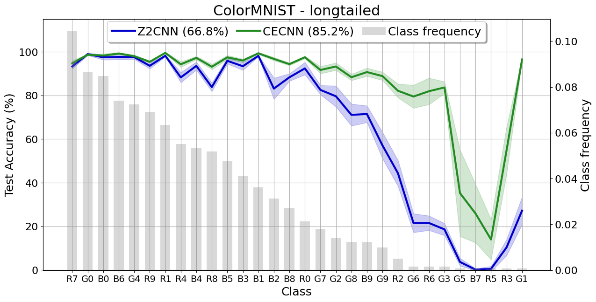

# Title

**Authors:** *S.A. Abbring, H.C. van den Bos, R. den Braber, A.J. van Breda, D. Zegveld*

---

TODO: Introduction text

---

## Color for Classification

<!---
TODO: Text about the influence of color on classification (related work: color invariance)
--->
Color is an important feature for recognition/classification by humans. One example is investiged by \[1\], who found that color facilitates expert bird-watchers in faster and more accurate recognition at both high (family) and low (specimen) levels of bird recognition. The convolutional layers in a Convolutional Neural Network (CNN) exhibit color representation similar to the human vision system \[2\]: all layers contain color selective neurons. Color representations are present at three different levels: in single neurons, in double neurons for edge detection and in combination with shape at all levels in the network. 

Although color invariance has been achieved in various research, such as in facial recognition to mitigate the influence of lightning conditions \[3\], some classification problems might be color dependent. Therefore, instead of training CNNs to classify images despite their color (invariance), classifying images because of their color (equivariance) might be more beneficial. Color equivariance can be achieved through group convolutions. 

## Recap on Group Equivariant Convolutions

<!---
TODO: Explain Group Equivariant Convolutions (technical)
--->
Deep Convolutional Neural Networks have been around since the late 1980s and over the years proven to be highly effective for image classification \[4\]. Empirical evidence shows the importance of depth for good performance and convolutional weight-sharing for parameter reduction. The latter is effective due to the translation symmetry inherent in most image data, whereby the data is roughly invariant to shifts, such that the same weights can be utilised to convolve different parts of the image \[5\]. Convolution layers are translation equivariant in a deep network: the output shifts relative to shifts in the input. This notion of symmetry can be extended to larger groups, including rotation.

The generalization of translation equivariance is achieved through Group Convolutional Neural Networks (G-CNN). A CNN layer is equivariant to a group if for all transformations $g \in G$, doing the transformation $T_g$ on the input and then the feature mapping $\Phi (x)$ is similar to doing the feature mapping on the input and the transformation $T'_g$ thereafter: 

$$\begin{align*} 
\Phi (T_g x) = T'_g \Phi (x) & \qquad \qquad \forall g \in G, & \qquad \qquad (\text{Equation 1})
\end{align*}$$

where $T_g$ and $T'_g$ can be equivalent.
We utilise the equation from \[5\] to show that G-CNNs are equivariant. Instead of shifting a filter, correlation in the first layer can be described more generally by replacing it with some transformation from group $G$, whereby $f$ is the input image and $\psi$ is the filter:

$$\begin{align*} 
[f \star \psi](g) = \sum_{y \in \mathbb{Z}^2}\sum_{k} f_k(y) \psi_{k}(g^{-1}y) & \qquad \qquad (\text{Equation 4})
\end{align*}$$

Since the feature map $f \star \psi$ is a function on G, the filters are functions on G for all layers after the first. The correlation then becomes:

$$\begin{align} 
[f \star \psi](g) = \sum_{h \in G}\sum_{k}f_k(h)\psi_{k}(g^{-1}h) & \qquad \qquad (\text{Equation 3})\\ 
\end{align}$$

Using the substition $h \rightarrow uh$ and the notation:
$$\begin{align} [L_gf](x) = [f \circ g^{-1}](x) = f(g^{-1}x) & \qquad \qquad (\text{Equation 4})\end{align} $$

, the equivariance of the correlation can be derived such that a translation followed by a correlation is equivalent to a correlation followed by a translation:

$$\begin{align} 
[[L_uf] \star \psi](g) &= \sum_{h \in G}\sum_k f_k(u^{-1}h)\psi(g^{-1}h)\\ 
&= \sum_{h \in G}\sum_kf(h)\psi(g^{-1}uh)\\
&= \sum_{h \in G}\sum_kf(h)\psi((u^{-1}g)^{-1}h)\\
&= [L_u[f \star \psi]](g) & \qquad \qquad (\text{Equation 5})\\
\end{align}$$

<!---
Mss zijn deze formules allemaal net iets teveel overgenomen van [2]
--->

## Color Equivariance
<!---
TODO: explain specifically for color equivariance (technical)
--->
The original paper exploits the concept of group equivariant convolutions to achieve color equivariance, defined as equivariance to hue shifts. In the HSV (Hue-Saturation-Value) color space, hue is represented as an angular scalar value. The hue value is shifted by adding an offset after which the modulo is taken to ensure a valid range. The HSV space is reprojected to the RGB (Red-Green-Blue) color space such that the hue shifts correspond to a rotation along the diagonal vector [1, 1, 1]. 

This definition is extended to group theory, by defining the group $H_n$ as a subgroup of the $SO(3)$ group. Specifically, $H_n$ consists of multiples of 360/n-degree rotations about the [1, 1, 1] diagonal vector in $\mathbb{R}^3$ space. The rotation around a unit vector $\mathbf{u}$ by angle $\theta$ is defined in 5 steps: 

1. Rotate the vector such that it lies in one of the coordinate planes (e.g. $xz$)
1. Rotate the vector such that it lies on one of the coordinate axes (e.g. $x$)
1. Rotate the point around vector $\mathbf{u}$ on the x-axis
1. Reverse the rotation in step 2
1. Reverse the rotation in step 1

This leads to the following parameterization of $H_n$, with $n$ the number of rotations (discrete) and $k$ the rotation:

$$ 
H_n = 
\begin{bmatrix}
\cos (\frac{2k\pi}{n}) + a & a - b & a + b \\
a + b & \cos (\frac{2k\pi}{n}) + a & a - b \\
a - b & a + b & \cos (\frac{2k\pi}{n}) + a \\
\end{bmatrix}
$$

The group of discrete hue shifts is combined with the group of discrete 2D translations into the group $G = \mathbb{Z}^2 \times H_n$. Now Color Equivariant Convolution (CEConv) in the first layer is defined:

$$\begin{align} 
[f \star \psi^i](x, k) = \sum_{y \in \mathbb{Z}^2}\sum_{c=1}^{C^l}f_c(y) \cdot H_n(k)\psi_c^i(y - x) & \qquad \qquad (\text{Equation 6})\\ 
\end{align}$$

For the derivation of the equivariance of the CEConv layer, we refer to the original paper BRON.

For the hidden layers, the feature map $[f \star \psi]$ is a function on $G$ parameterized by x,k. The CEConv hidden layers are defined as:

$$\begin{align} 
[f \star \psi^i](x, k) = \sum_{y \in \mathbb{Z}^2}\sum_{r=1}^n\sum_{c=1}^{C^l}f_c(y,r) \cdot \psi_c^i(y - x, (r-k)\%n) & \qquad \qquad (\text{Equation 7})\\ 
\end{align}$$

<!---
The operator $\mathcal{L}_g = \mathcal{L}_{(t, m)}$ expresses the translation $t$ and hue shift $m$ acting on input $f$:

$$\begin{align} 
[\mathcal{L}_gf](x) = [\mathcal{L}_{(t,m)}f](x) = H_n(m)f(x-t)& \qquad \qquad (\text{Equation 7})\\ 
\end{align}$$

The derivation equivariance of the CEConv layer can be derived (for $C^l = 1$) as:
--->

## (Maybe Architecture/Evaluation/Dataset(s) explanation or Something)

## Reproduction of Experiments

TODO: explain findings about the reproduction of figure 2, figure 2, figure 9 and figure 13 in the following narrative: 

### When is color equivariance useful? 

#### Color imbalance

To verify that color equivariance can share shape information across classes, we reproduced the long-tailed ColorMNIST experiment.  In this experiment, a 30-way classification is performed on a power law distributed dataset where 10 shapes (digits 0-9) and 3 colors (Red, Green, Blue) need to be distinguished. During training, classes are not equally distributed. During testing, all classes are evaluated on 250 examples. Sharing shape information across colors is beneficial during this experiment as a certain digit may occur more frequently in one color than in another. 

Two models were tested. The Z2CNN, a vanilla CNN model, consists of 25,990 trainable parameters whereas the CECNN model consists of 25,207 trainable parameters, This is because the width of the CECNN is smaller. This is to ensure that the same amount of GPU memory is required to train the models, which was a priority of the original authors to have a level comparison. However, the training time of the two models differed significantly with the Z2CNN model training 59%$\pm$4 faster than the CECNN network. The exact training method and performance can be seen in the provided notebook. 

The figure is ordered in the availability of training samples for every class. Performance of the shape-sharing CECNN consistently outperforms the baseline Z2CNN, where the average performance of the Z2CNN is 68.8%$\pm$0.6% and for the CECNN is 85.2$\pm$1.2%. Most performance increase is seen in classes where little training data is provided thus confirming the hypothesis that the CECNN is able to share shape weight information effectively. These results are in line with the findings of the original authors which also describe a large performance increase. A difference in findings is the std of the CECNN which is larger than that of the Z2CNN however, this could be due to the randomness in data generation* which resulted in a different data distribution for our experiment.

* We made the data generation deterministic by setting a seed, recreating our experiment would return the same data distribution.

#### Color Selectivity

TODO: in which stages is color equivariance useful (figure 3 about color selective datasets)

### Color Equivariance in Image Classification and impact of hyperparameters

#### Image Classification

TODO: color equivariant cnns versus vanilla cnns (table 1 but then figure 9)

#### Number of Rotations

TODO: the impact of the number of hue rotations (figure 13)

## Further Research

### Rens

### Dante

### Silvia

TODO: create a nice narrative with these three

## Concluding Remarks

## Authors' Contributions

## References
<a id="1">[1]</a> 
Simen Hagen, Quoc C. Vuong, Lisa S. Scott, Tim Curran, James W. Tanaka; The role of color in expert object recognition. Journal of Vision 2014;14(9):9. https://doi.org/10.1167/14.9.9.

<a id="1">[2]</a> 
Ivet Rafegas, Maria Vanrell; Proceedings of the IEEE International Conference on Computer Vision (ICCV), 2017, pp. 2697-2705 

<a id="1">[3]</a> 
R. Rama Varior, G. Wang, J. Lu and T. Liu, "Learning Invariant Color Features for Person Reidentification," in IEEE Transactions on Image Processing, vol. 25, no. 7, pp. 3395-3410, July 2016, doi: 10.1109/TIP.2016.2531280.
keywords: {Image color analysis;Lighting;Cameras;Histograms;Shape;Dictionaries;Robustness;Person re-identification;Illumination invariance;Photometric invariance;Color features;Joint learning;Person re-identification;illumination invariance;photometric invariance;color features;joint learning},

<a id="1">[4]</a>
W. Rawat and Z. Wang, "Deep Convolutional Neural Networks for Image Classification: A Comprehensive Review," in Neural Computation, vol. 29, no. 9, pp. 2352-2449, Sept. 2017, doi: 10.1162/neco_a_00990. 

<a id="1">[5]</a>
Cohen, T. &amp; Welling, M.. (2016). Group Equivariant Convolutional Networks. <i>Proceedings of The 33rd International Conference on Machine Learning</i>, in <i>Proceedings of Machine Learning Research</i> 48:2990-2999 Available from https://proceedings.mlr.press/v48/cohenc16.html.

