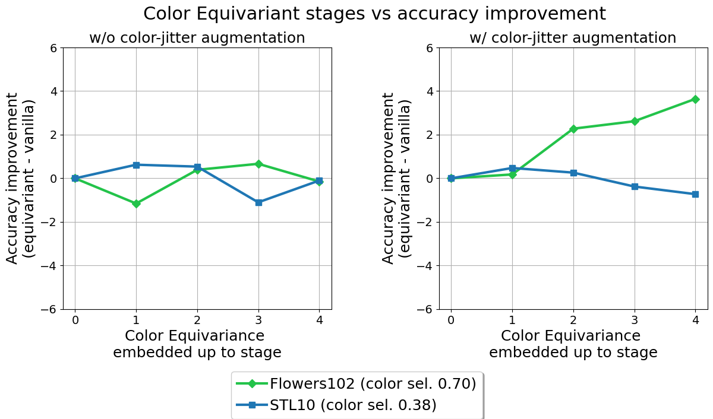
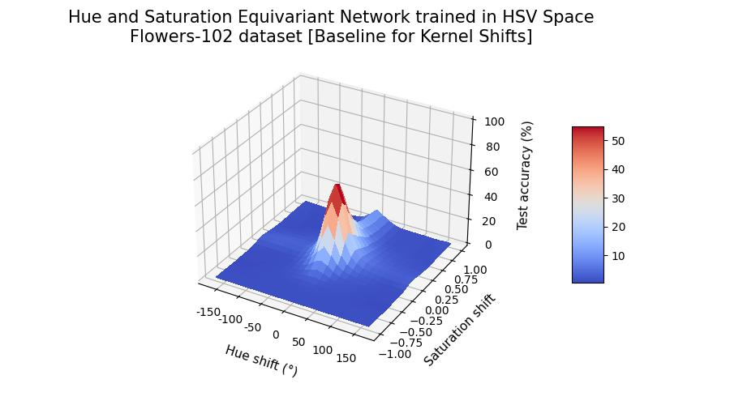
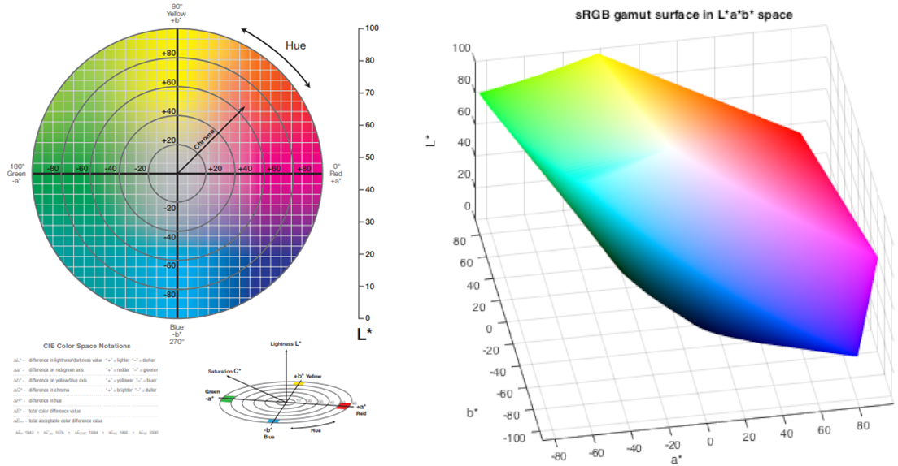

# A deep dive into color space equivariant networks

**Authors:** *S.R. Abbring, H.C. van den Bos, R. den Braber, A.J. van Breda, D. Zegveld*

---

In this blog post, we discuss, analyze, and extend upon the findings of the paper titled *Color Equivariant Convolutional Networks* [[5]](#main). The paper introduces Color Equivariant Convolutions (CEConvs) that leverage parameter sharing over hue shifts. The authors demonstrate the benefits of the novel model in terms of robustness to color alterations and classification accuracy when confronted with test-time hue shifts.
The objectives of this blog post are to:

1. Discuss the methods introduced in the paper
1. Verify the authors' claims
1. Extend the notion of color equivariance to other dimensions beyond hue by leveraging different color spaces than RGB

---

## Introduction

Color is a crucial feature in how people identify and recognize objects. For example, a study by [[8]](#bird) found that color facilitates expert bird watchers in faster and more accurate recognition at both high (family) and low (specimen) levels of bird identification. Similarly, the convolutional layers in a Convolutional Neural Network (CNN) exhibit color representation akin to the human visual system [[4]](#human_vision) with all layers containing color-selective neurons. These color representations are present at three different levels: in single neurons, in double neurons for edge detection, and in combination with shapes at all levels in the network.

Although color invariance has been achieved in various research areas, such as in facial recognition to mitigate the influence of lighting conditions [[7]](#color_invariance), some classification problems are color-dependent. Therefore, instead of training CNNs to classify images regardless of their color (invariance), it might be more beneficial to classify them using a color equivariant network. 

The Color Equivariant Convolutions (CEConvs) introduced in [[5]](#main) achieve this through equivariance to discrete hue shifts. Hue is represented in RGB space as a 3D rotation around the [1, 1, 1] axis. This approach utilizes group convolutions as introduced by [[1]](#group_convs) which can be equivariant to 3D rotations. We reproduce the results showing the effectiveness of CEConvs on color-imbalanced and color-selective datasets, as well as their impact on image classification. We examine the ablation studies to understand the impact of data augmentation and rotation on CEConvs, while also providing additional insights into computational requirements. Finally, we extend the notion of color equivariance to different color spaces.

<!--
The most significant limitation of the CEConvs is that color equivariance is modeled as solely equivariance to hue shifts. By extending the notion to other dimensions, such as saturation equivariance, the CNN could achieve a higher level of equivariance, as saturation can handle a greater variety of changes in illumination. Additionally, by modeling hue shifts as 2D rotations compared to 3D rotations for the RGB space, we circumvent the limitation described in \[main\]. This limitation involves pixel values falling outside the RGB cube, requiring a reprojection operation and consequently only allowing for an approximation of hue equivariance for pixels near the border of the RGB cube.
-->

## Recap on Group Equivariant Convolutions

Deep Convolutional Neural Networks have been proven to be highly effective for image classification [[10]](#DCNN). Empirical evidence shows the importance of depth for good performance and convolutional weight-sharing for parameter reduction. The latter is effective due to the translation symmetry inherent in most image data, whereby the data is roughly invariant to shifts. In this manner, the same weights can be utilized to convolve different parts of the image [[1]](#group_convs). 
Convolutional layers are translation equivariant in a deep network: the output shifts relative to shifts in the input. This notion of symmetry can be extended to larger groups, including rotation.

This generalization of translation equivariance is achieved through Group Convolutional Neural Networks (G-CNN). A CNN layer is equivariant to a group if for all transformations $g \in G$, doing the transformation $T_g$ on the input and then the feature mapping $\Phi (x)$ is similar to doing the feature mapping on the input and the transformation $T'_g$ thereafter: 

$$\begin{align*} 
\Phi (T_g x) = T'_g \Phi (x) & \qquad \qquad \forall g \in G, \\
\end{align*}
\tag{1}$$

where $T_g$ and $T'_g$ can be equivalent.
We utilize the equations from [[1]](#group_convs) to show that G-CNNs are equivariant. Instead of shifting a filter, correlation in the first layer can be described more generally by replacing it with some transformation from group $G$, whereby $f$ is the input image and $\psi$ is the filter:

$$\begin{align*} 
\[ f \star \psi \](g) = \sum_{y \in \mathbb{Z}^2}\sum_{k} f_k(y) \psi_{k}(g^{-1}y) \\
\end{align*}
\tag{2}$$

Since the feature map $f \star \psi$ is a function on G, the filters are functions on G for all layers after the first. The correlation then becomes:

$$\begin{align} 
\[ f \star \psi \](g) = \sum_{h \in G}\sum_{k}f_k(h)\psi_{k}(g^{-1}h)\\ 
\end{align}
\tag{3}$$

Using the substitution $h \rightarrow uh$ and the notation defining the left regular representation, whereby the group is acting on the transitive input space of the function $f: X \rightarrow Y$:

$$\begin{align} 
\[ L_g f \](x) = \[ f \circ g^{-1} \](x) = f(g^{-1}x)
\end{align} 
\tag{4}$$

The equivariance of the correlation can be derived such that a translation followed by a correlation is equivalent to a correlation followed by a translation:

$$\begin{align} 
\[\[L_uf\] \star \psi\](g) &= \sum_{h \in G}\sum_k f_k(u^{-1}h)\psi(g^{-1}h)\\ 
&= \sum_{h \in G}\sum_kf(h)\psi(g^{-1}uh)\\
&= \sum_{h \in G}\sum_kf(h)\psi((u^{-1}g)^{-1}h)\\
&= \[L_u\[f \star \psi\]\](g)\\
\end{align}
\tag{5}$$

## Color Equivariance

The original paper exploits the concept of group equivariant convolutions to achieve color equivariance, defined as equivariance to hue shifts. In the HSV (Hue-Saturation-Value) color space, hue is represented as an angular scalar value. The hue value is shifted by adding an offset after which the modulo is taken to ensure a valid range. The HSV space is reprojected to the RGB color space such that the hue shifts correspond to a rotation along the diagonal vector [1, 1, 1]. 

This definition is extended to group theory, by defining the group $H_n$ as a subgroup of the $SO(3)$ group. Specifically, $H_n$ consists of multiples of $\frac{360}{n}$-degree rotations about the [1, 1, 1] diagonal vector in $\mathbb{R}^3$ space. 
<!--- The rotation around a unit vector $\mathbf{u}$ by angle $\theta$ is defined in 5 steps: 

1. Rotate the vector such that it lies in one of the coordinate planes (e.g. $xz$)
1. Rotate the vector such that it lies on one of the coordinate axes (e.g. $x$)
1. Rotate the point around vector $\mathbf{u}$ on the x-axis
1. Reverse the rotation in step 2
1. Reverse the rotation in step 1 -->
This leads to the following parameterization of $H_n$, with $n$ the number of rotations (discrete), $k$ the rotation, $a = \frac{1}{3} - \frac{1}{3}\cos (\frac{2k\pi}{n})$ and $b = \sqrt{\frac{1}{3}} \cdot \sin (\frac{2k\pi}{n})$:

$$ 
H_n = 
\begin{bmatrix}
\cos (\frac{2k\pi}{n}) + a & a - b & a + b \\
a + b & \cos (\frac{2k\pi}{n}) + a & a - b \\
a - b & a + b & \cos (\frac{2k\pi}{n}) + a \\
\end{bmatrix}
\tag{6}
$$

The group of discrete hue shifts is combined with the group of discrete 2D translations into the group $G = \mathbb{Z}^2 \times H_n$. The Color Equivariant Convolution (CEConv) in the first layer is defined in [[5]](#main) as:

$$
\begin{align} 
\[f \star \psi^i\](x, k) = \sum_{y \in \mathbb{Z}^2}\sum_{c=1}^{C^l}f_c(y) \cdot H_n(k)\psi_c^i(y - x)\\ 
\end{align}
\tag{7}
$$

However, a small error is present here as the sum $\sum\limits_{c=1}^{C^l}$ indicates that $f_c(y)$ and $\psi_c^i(y - x)$ are scalar values. This interpretation is inconsistent given the dot product and the matrix $H_n(k)$.
Therefore the correct formula should be:

$$
\begin{align} 
\[f \star \psi^i\](x, k) = \sum_{y \in \mathbb{Z}^2}f(y) \cdot H_n(k)\psi^i(y - x)\\ 
\end{align}
\tag{8}
$$

This change does not impact the derivation of the equivariance of the CEConv layer, as given in the original paper [[5]](#main).

For the hidden layers, the feature map $[f \star \psi]$ is a function on $G$ parameterized by $x$ and $k$. The CEConv hidden layers are defined as:

$$\begin{align} 
\[f \star \psi^i\](x, k) = \sum_{y \in \mathbb{Z}^2}\sum_{r=1}^n f(y,r) \cdot \psi^i(y - x, (r-k) \\% n)\\ 
\end{align}
\tag{9}$$

## Reproduction of Experiments

The reproduction of (a selection of) the experiments is primarily achieved through the code provided along with the original paper. However, it does not include the code to reproduce the plots which had to be written manually. Moreover, supplementing functionalities such as saving, loading, and evaluation of the results needed to be integrated for sufficient reproduction. Lastly, not all commands are provided/explained in the READme file to easily run all experiments. Therefore, some investigation of the code was needed to run the exact experiments.

### When is color equivariance useful? 

Firstly, the experiments that show the importance of color equivariance are reproduced. This mainly includes exploring various datasets, starting with a color-imbalanced dataset and followed by the investigation of datasets with a high/low color selectivity.

#### Color imbalance

To verify that color equivariance can share shape information across classes, we reproduced the long-tailed ColorMNIST experiment.  In this experiment, a 30-way classification is performed on a power law distributed dataset where 10 shapes (digits 0-9) and 3 colors (Red, Green, Blue) need to be distinguished. During training, classes are not equally distributed. During testing, all classes are evaluated on 250 examples. Sharing shape information across colors is beneficial during this experiment as a certain digit may occur more frequently in one color than in another. 

Two models were tested. The Z2CNN, a vanilla CNN model, consisting of 25,990 trainable parameters, and the CECNN model consisting of 25,207 trainable parameters. Due to the width of the CECNN being smaller, to ensure that the same amount of GPU memory is required to train the models, which was a priority of the original authors to have a level comparison. However, the training time of the two models differed significantly with the Z2CNN model training 59% $\pm$ 4 faster than the CECNN network. Because of this, we did an additional experiment where we tried to have the training times the same as each other by fluctuating the number of 
parameters. This experiment is done in Appendix [Training time study](#d-training-time-study). The exact training method and performance can be seen in the provided notebook. 

<!--  -->

  

  *Figure 1: Classification performance of a normal CNN (Z2CNN) and the color equivariant convolutions CNN (CECNN) on a long-tailed, unequally distributed dataset, illustrating the impact of weight sharing in the color domain.*

The figure is ordered in the availability of training samples for every class. Performance of the shape-sharing CECNN consistently outperforms the baseline Z2CNN, where the average performance of Z2CNN is 68.8% $\pm$ 0.6% and CECNN is 85.2 $\pm$ 1.2%. Most performance increase is seen in classes where little training data is provided thus confirming the hypothesis that the CECNN is able to share shape weight information effectively. These results are in line with the findings of the original authors which<!--who--> also describe<!--als het althans over de auteurs gaat die hebben beschreven, dan described lijkt me want ze hebben het al geschreven--> a large performance increase. A difference in findings is the std. deviation of the CECNN which is larger than that of the Z2CNN. However, this could be due to the randomness in data generation* which resulted in a different data distribution for our experiment.

* We made the data generation deterministic by setting a seed, and recreating our experiment would return the same data distribution.

#### Color Selectivity

Color selectivity is defined as: “The property of a neuron that activates highly when a particular color appears in the input image and, in contrast, shows low activation when this color is not present.” [[3]](#color_selectivity)<!--idk, word niet helemaal warm van een quote/citaat. Denk dat het dan beter gecombineerd kan worden met de volgende zin, als in "The authors define the color selectivity of a dataset as the degree in which a neuron is activated when a particular color appears in an input image"? Mwah vind mn suggestie niet beter ik snap denk wel wrm het citaat er staat nu-->. The authors of the original paper utilize this notion to define the color selectivity of a dataset as an average of all neurons in the baseline CNN trained on the respective dataset. We reproduced the experiment to investigate the influence of using color equivariance up to later stages. Due to computational constraints, only two of the four datasets were explored; flowers102 with the highest color selectivity (0.70) and STL10 with the lowest color selectivity (0.38). While we did not explore the remaining datasets extensively, their color selectivity was comparable to STL10, suggesting that our findings are inclusive for these datasets.

In Figure 2, the accuracy improvement of color equivariance up to later stages in the network is displayed for the aforementioned datasets. The baseline is the ResNet18 model with one rotation (equivariance up to 0 stages). For the other values, HybridResNet18 models are trained with 3 rotations, max pooling, separable kernels, and the number of color equivariant stages as shown in the figure. Additionally, the graph on the right shows the result with color-jitter augmentation.

  

  *Figure 2: Influence of color equivariance embedded up to late stages in the network on datasets with high and low color selectivity.*

Similar to the original paper’s results, the color-selective dataset seems to benefit from color equivariance up to later stages in the network, in contrast to the less color-selective dataset. This is especially clear for the graph with color-jitter augmentation. However, the color selectivity seems detrimental at the earlier stages without color-jitter augmentation for the color-selective dataset. In general, the accuracy improvements/deteriorations are less extreme compared to the original results. The differences might be explained by the fact that we trained the model on the full datasets instead of on a subset. By our results, we suspect that color equivariance is solely significantly beneficial for color-selective datasets in combination with color-jitter augmentation. Otherwise, the differences are negligible. 

### Color Equivariance in Image Classification and impact of hyperparameters

We will now explore the reproduction of the main results along with a small insight into the hyperparameters. These results are all limited to the Flowers102 dataset since it has the largest color discrepancy and the ResNet18 model, aligning with the original paper. The final experiment is an ablation study investigating the impact of varying the number of rotations. This aspect is altered across different experiments, highlighting its importance.
<!-- The results were placed in the appendix of the original paper. However, we decided that the reproduction of the figure on one dataset is more insightful than an enormous table. ---> <!-- omg hahah dat laatste in die comment klinkt als een uithaal naar de original paper :'D -->

#### Image Classification

<!--
In our evaluation of image classification performance, we utilized the flowers-102 dataset due to its most prominent color dependency across the datasets evaluated by the original authors. 
--->
Our evaluation of image classification performance involved training a baseline ResNet-18 model comprising approximately 11,390,000<!-- zou gwn 11 million zeggen of aantal parameters weglaten en het als baseline in die tabel hier beneden zetten oh maar dan heb je ook nog die klote accuracy nodig of huh? oh maybe haal ik dingen door elkaar idk man/vrouw. Is nu niet helemaal duidelijk denk ik op eerste gezicht te lezen waarom hier aantal parameters wordt benoemd, denk dat je wil laten weten dat ondanks de rotaties de parameters alsnog ongeveer gelijk blijven?--> parameters, alongside the novel color equivariant CE-ResNet trained with three rotations. Both models underwent training with and without jitter, augmenting the training data with varying hue-intensity images. Subsequently, we assessed their performance on test sets subjected to gradual hue shifts ranging from -180° to 180°.

  

  *Figure 3: Test accuracy on flowers classification dataset under a test time hue shift*

In the figure presented, both the baseline ResNet and the CE-ResNet demonstrate good performance when no hue shift is applied (Test-time hue shift = 0). The CE-ResNet displays optimal performance in three specific hue areas, which reflects the orientations it is trained on. Moreover, the CE-ResNet consistently maintains performance levels above or equal to the original ResNet across almost all hue shifts, indicating its dominance across distributional changes.

When trained with jitter, both models exhibit robustness against distributional shifts, in line with the original author's findings, with the CE-ResNet-18 showing slightly better performance.  This advantage is attributed to more efficienct weight sharing, entailing more information could be stored about other features. Additional insights into the optimal degree of jitter for CE-ResNet-18 is investigated in Appendix [Reproduction of Jitter Ablation Study](#c-reproduction-of-jitter-ablation-study). In contrast, these models did take around 6 times as long to train than the non-jittered models. The extended training duration of these models could be attributed to the convoluted sampling process involved in generating jittered images.

Comparing training and testing times, the baseline model completes its training approximately 50% faster than the CEConv model. Testing time took around 2.3 times as long for the novel CEConv model. This indicates a significant speed advantage for production with the baseline model, albeit with a slight sacrifice in performance due to the lack of CEConvs.

#### Number of Rotations

The main implementation of color-equivariance consists of adding three rotations of 120 degrees, whereas the baseline model (not-equivariant) can be expressed as having 1 rotation. In Figure 4, we reproduced the experiments examining the effect of additional rotations. In order to save computational power, we limited the experiments to 1, 5, and 10 rotations (instead of 1-10 in the original paper)<!--van mij hoeft het deel tussen haakjes niet per se in dit geval want vanuit "we limited" blijkt al dat we het hebben aangepast-->. The accuracy is evaluated on 37 points, in accordance with the original paper.

  

  *Figure 4: Accuracy with varying rotations.*

Although the lines in the plot are not smooth due to the evaluation on 37 points, the trends are similar to the original paper’s findings.<!--Misschien beter om hierboven te zeggen dat het geevalueerd is op 37 points en/of dat in accordance met original paper--> The number of peaks aligns with the number of rotations. Additionally, the height of the peaks decreases as the number of rotations increases. However, the peaks have different heights which might be attributed to the reprojection into the RGB cube range. Based on these results it seems that more rotations lead to higher equivariance. These results lead to a trade-off between the amount of equivariance, the maximum accuracy, and the number of parameters as displayed in Table 1. However, when evaluating this trade-off, it is important to consider that equivariant models tend to be more data efficient compared to non-equivariant models.

| Number of Rotations        | Number of Parameters     | Max. Accuracy    |
|--------------|-----------|-----------|
| 1 | 11.2 M  | 70.3%  |
| 5 | 11.6 M  | 72.4%  |
| 10 | 11.8 M  | 74.6%  |

*Table 1: Parameter and maximum accuracy increase based on number of rotations.*

## Further Research

The reproduced results showcase that the notion of equivariance can be extended to photometric transformations by incorporating parameter sharing over hue shifts. However, as opposed to what the title of the paper suggests, these networks are only equivariant to hue shifts and not fully color equivariant. We therefore set out to explore if we can move one step closer to achieving a fully color equivariant CNN by adding saturation or value shift equivariance in addition to hue shift equivariance. In order to disentangle the channels, we experiment with switching from the RGB color space to the HSV color space.

Additionally, one noticeable flaw in the work of [[5]](#main) is the fact that they model hue shifts with a 3D rotation in the RGB space along the diagonal vector
[1,1,1]. This can cause pixels with values close to the boundaries of the RGB cube to fall outside the RGB cube when rotated for certain hue shifts. In order to stay within the RGB space, these pixels have to be reprojected back into the RGB cube, effectively clipping the values. We explore if we can circumvent these limitations by modeling the hue shift as a 2D rotation in the LAB color space.
For an overview of the color spaces and their limitations, we refer to section [Color Spaces](#a-color-spaces) in the Appendix.

### HSV Equivariance

**Shifting the Kernel -** In our implementation of the HSV space, **hue** is modeled as an angular value between 0 and $2\pi$ and can be changed by adding or subtracting such an angle modulo $2\pi$. Therefore, we represent the group $H_n$ as a set of $\frac{2\pi}{n}$ rotations: $H_n = \\{ \frac{2\pi}{n} k | k \in \mathbb{Z}, 0 \leq k \lneq n \\} $, and due to the circular definition of hue the group $H_n$ is isomorphic to the cyclic group $C_n$. In HSV space this can be parameterized as the vector: 

$$
H_n(k) = \\begin{bmatrix} \frac{2\pi}{n} k \\\\ 0 \\\\ 0 \\end{bmatrix} 
\tag{10}
$$

In which $n$ is the discrete number of rotations and $k$ indicates the $k$-th rotation out of $n$. The group action is an addition on an HSV pixel value in $\mathbb{R}^3$ modulo $2\pi$:

$$
\[H_n(k)f\] (x) = \\begin{bmatrix} (f(x)_h + \frac{2\pi}{n} k) \\% 2\pi \\\\ f(x)_s \\\\ f(x)_v \\end{bmatrix}
\tag{11}
$$

with $f(x)_{h,s,v}$ indicating the respective hue, saturation, or value at pixel value $x$ in input image $f$. [[5]](#main) applies this transformation on the kernel made possible by the use of the inverse of the rotation matrix. However, in hue space a shift is defined as an addition, which alleviates the problem of reprojection but is a non-linear operation, and therefore: <!-- I thought the modulo was the problem not the addition-->

$$
\[H_n(k)f\] (x) \cdot \psi(y) \neq f(x) \cdot \[H_n(-k)\psi\](y)
\tag{12}
$$

To see this difference some models are trained in which the kernels are naively shifted as if they were an image and compared to models in which the shift is applied to the images. Shifting the image is done following the approach of [[10]](#lifting), which shows that transforming the signal instead of the kernel <!--is indeed possible and that these operations are--> is equivalent when restricted to the group and standard convolution. This allows for more general transformations than using the group correlation of [[1]](#group_convs). 

We can now define the group $G = \\mathbb{Z}^2 \\times H_n$ as the product of the 2D integers translation group and the HSV hue shift group. With $\\%$ as the modulo operator and $\\mathcal{L}_{t, m}$ defining a translation and hue shift:

$$
\[\mathcal{L}_{t, m}f\](x) = \[H_n(m)f\](x-t) = \\begin{bmatrix} (f(x - t)_h + \frac{2\pi}{n} m) \\% 2\pi \\\\ f(x - t)_s \\\\ f(x - t)_v \\end{bmatrix}
\tag{13}
$$

We can then define the lifting layer outputting the $i$-th output channel as:

$$
\[\psi^i \star f \](x, k) = \sum_{y \in \mathbb{Z}^2} \psi^i(y) \cdot \[H_n(k)f\](y-x) 
\tag{14}
$$

Here $f$ is the input image and $\psi^i$ a set of corresponding filters.
The equivariance can be shown as:

$$\begin{align}
\[\psi^i \star \[ \mathcal{L}\_{t, m\} f \] \](x, k) &= \sum_{y \in \mathbb{Z}^2} \psi^i(y) \cdot \[H_n(k-m)f\](y-(x-t)) \\
&= \[\psi^i \star f\](x-t, k-m)\\
&= \[\mathcal{L}'_{t, m}[\psi^i \star f\]\](x, k)
\end{align}
\tag{15}$$

Since the input HSV image is now lifted to the group space, all subsequent features and filters are functions that need to be indexed using both a pixel location and a discrete rotation. The group convolution can then be defined as:

$$
\[f \star\psi^i\](x, k) = \sum_{y \in \mathbb{Z}^2} \sum_{r=1}^n f(y,r) \cdot \psi^i(y-x, (r-k)\\% n)
\tag{16}
$$

**Saturation** is represented as a number between 0 and 1, requiring a group that contains $n$ elements equally spaced between -1 and 1 to model both an increase and decrease in saturation. This makes all group elements fall in the set:
$H_n = \\{-1 +k\frac{2}{n-1} | n \geq 2, k = 0,1,2,...,n-1 \\}$. In HSV space this can be parameterized as the vector:

$$
H_n(k) = 
\begin{bmatrix} 0 \\\\ -1 +k\frac{2}{n-1} \\\\ 0 
\end{bmatrix} 
\tag{17}
$$

Because saturation is only defined between 0 and 1 and is acyclic, we clip the value after the group action:

$$
\[H_n(k)f\](x) = 
\begin{bmatrix} f(x)_h \\\\ \text{clip}(0, f(x)_s + (-1 + k \frac{2}{n-1}), 1) \\\\ f(x)_v 
\end{bmatrix}
\tag{18}
$$

This clipping due to the acyclic nature of saturation might break equivariance, which will be tested with several experiments: applying the group action on the kernel and the image ([saturation equivariance](#saturation-equivariance)), and testing different values for $n$ ([ablation study](#b-ablation-study-saturation-equivariance)).

**Value** equivariance can be modeled in the same way as described for saturation where the group action is now acting upon the value channel:

$$
\[H_n(k)f\](x) = \\begin{bmatrix} f(x)_h \\\\ f(x)_s \\\\ \text{clip}(0, f(x)_v + (-1 + k \frac{2}{n-1}), 1) \\end{bmatrix}
\tag{19}
$$

Due to our earlier experiments involving the application of the group element on the kernel or the image, we decided to only model the value shift on the input images.

<!--
**Shifting the Input Image -** In order to circumvent some of the issues that present themselves when naively shifting the kernel as though it were an image, we investigated whether we could perform the lifting convolution by shifting the input image instead of the kernel. This is a more intuitive approach and [[10]](#lifting) show that transforming the signal instead of the kernel #is indeed possible and that these operations are# is equivalent when restricted to the group and standard convolution. This allows for more general transformations than using the group correlation of [[1]](#group_convs). In our case, where we make use of the HSV color space with separated hue, saturation and value channels, this way of performing the lifting operation is required due to the fact that we perform our action on these separated channels. Transforming the signal instead of the kernel allows us to alter the values of pixels instead of only moving the pixel locations. 

We can thus define the lifting layer outputting the $i$-th output channels for our semigroup $H$ of hue shifts as follows:

$$
\[\psi^i \star f\](x, k) = \sum_{y \in \mathbb{Z}^2} \psi^i(y) \cdot H_n(k)\[f\](y-x)
\tag{20}
$$

In a similar way, we can create the lifting layer for the saturation and value groups.
--> 

**Combining Multiple Shifts -** Because of the separated channels when utilzing the HSV color space, we can describe the group product between multiple channel shifts as the direct product of the previously described groups.

$$ 
G = \mathbb{Z}_2 \times C_n \times \mathbb{R} \times \mathbb{R} 
\tag{20}
$$

The group action for the corresponding $h'$, $s'$, and $v'$ discrete hue, saturation and value shifts respectively, is then defined as:

$$
\mathcal{L}_{(t, h',s',v')} = \[H_n(h',s',v')f\](x-t) = 
\begin{bmatrix} (f(x-t)_h + \frac{2\pi}{n} h') \\% 2\pi \\\\ \text{clip}(0, f(x-t)_s + (-1 + s' \frac{2}{n-1}), 1) \\\\ \text{clip}(0, f(x-t)_v + (-1 + v' \frac{2}{n-1}), 1)
\end{bmatrix}
\tag{21}
$$

<!-- 
DEZE KAN NU WEG DENK IK OMDAT HIJ 22 VERVANGT
$$ 
\mathcal{L}_{(x',h',s',v')} (x) = (f(x)_{h'} \cdot f(x - x')_h, \ f(x)_{s'} \cdot f(x - x')_s, \ f(x)_{v'} \cdot f(x - x')_v)
\tag{23}
$$ 
-->

#### LAB Equivariance 
Hue equivariance in the LAB color space can be modeled as a 2D rotation on the *a* and *b* channels. However, due to the differences that arise when converting between RGB/HSV and LAB space as outlined below, it could be difficult for a hue equivariant model trained on LAB space hue equivariance to also become equivariant to hue space shifted images in RGB/HSV format which are thereafter converted to LAB format.

  

  *Figure 5: An example image (original far left) hue space shifted multiple times in HSV (angular addition), RGB (3D rotation), and LAB (2D rotation) space, thereafter converted to RGB space for visualization. ([source](CEConv/plot_hue_comparison.py))*

Figure 5 shows this difference with a hue shift in RGB and HSV space resulting in the same image. However, performing the same shift in LAB space and converting it back to RGB space afterward, results in a slightly different colored image.

For the LAB space, only a hue shift equivariant model is implemented. For this, the theory in Section [Color Equivariance](#color-equivariance) is applicable with the only exception being the reparameterization of <!--the group--> $H_n$:

$$ 
H_n = 
\begin{bmatrix}
1 & 0 & 0 \\
0 & \cos(\frac{2k\pi}{n}) & -\sin(\frac{2k\pi}{n}) \\
0 & \sin(\frac{2k\pi}{n}) & \cos (\frac{2k\pi}{n})\\
\end{bmatrix}
\tag{22}
$$

In which $n$ represents the number of discrete rotations in the group and $k$ indexes the rotation to be applied. The group operation is now a matrix multiplication on the $\mathbb{R}^3$ space of LAB pixel values. The rest of the operations can be left the same. Because we are rotating on a rectangular plane we can never fall out of the lab space. Thus, there is no need for reprojection.

### Results of Additional Experiments
The experiments of the various color spaces are conducted on the Flowers102 dataset, similar to section [Image Classification](#image-classification).

#### HSV

##### Hue Shift Equivariance
**Shifting the Kernel -** For this experiment, where we naively shift the hue of the input layer filters, we took a ResNet-18 network and replaced the standard convolutional layers with our group convolutional layers. Here the first layer will perform the lifting convolution that maps our input image to the group and the later layers perform the corresponding group convolutions. The network is trained for 3 discrete hue rotation angles, namely 0°, 120°, and 240° (-120°).
We separate 2 cases where we train the potential equivariant network (CE-ResNet-18) with hue jitter, randomly applying a hue shift with a uniformly chosen hue factor between -0.5 and 0.5, and without any hue jitter. Additionally, for comparison we train 2 baseline models of a ResNet-18 network with and without hue jitter, where the width of the network is increased such that the number of parameters between the equivariant and baseline networks is equal.

  

  *Figure 6: Illustrates the test accuracy scores of a variety of models evaluated with 37 Test-time hue shifts spanning the full range of -180° to 180° hue rotations. The CE-ResNet-18 models are trained for 3 discrete hue rotations of 0°, 120°, and 240° applied to the kernel during the lifting convolution. The baseline models are standard ResNet-18 CNNs without any group convolutional layers. ([source](CEConv/plot_fig9_hue.py))* 

<!--
As expected, naively shifting the kernel does not work. In Fig 5, there is a clear peak for both the CE-ResNet-18 and corresponding baseline model at the 0° hue shift angle (thus no shift is performed). The further the hue is shifted from the image’s original values, the worse the performance of these models becomes. Additionally, it can be seen that when training with a hue jitter data augmentation, the ResNet model is expressive enough to perform robustly over the entire hue spectrum. However, the performance of the CE-ResNet-18 still does not excel over its baseline counterpart.
The reason why this approach does not achieve hue shift equivariance is due to the fact that we cannot utilize and hue shift this kernel as though it were an image. This brings a host of inconsistencies with it, for example, applying the hue shift on the weights directly acts more as an added bias than a rotation of the hue. Moreover, weights that are negative get mapped to a relatively high positive hue value after applying the modulus operation rather than a low one. This also breaks the condition that, all groups must satisfy: where for each element of the group there should exist an inverse of this element which retrieves the identity element. This is not true as per the modulus operation when applied to the negative values in a kernel, we can never retrieve the negative values by applying the inverse of the action. Thus, while it was an interesting experiment for the HSV space this approach has no merits.

Verkorte versie:
-->
As expected, naively shifting the kernel does not work. In Figure 6, both the CE-ResNet-18 and the baseline model show a peak at the 0° hue shift angle, with performance deteriorating as the hue shift increases. Training with hue jitter data augmentation enables the ResNet model to perform robustly across the hue spectrum, but the CE-ResNet-18 still does not outperform the baseline. This failure to achieve hue shift equivariance stems from the inability to treat and shift the kernel like an image, leading to inconsistencies. For example, the hue shifts act more as added bias than a rotation, and negative weights are mapped to high positive hue values rather than low values due to the modulo operator. In addition, the latter violates the group property of the existence of an inverse, since we cannot reverse the modulus operation to retrieve negative values. Consequently, while this was an interesting experiment in HSV space, this approach has no practical merit.

**Shifting the Input Image -** Instead of naively hue-shifting the kernel we now perform the lifting convolution by shifting the input image effectively creating a hue-shifted image stack. Thus we transform the signal rather than the kernel. The experimental setup is identical to the previous experiment.

  

  *Figure 7: Illustrates the test accuracy scores of a variety of models evaluated with 37 Test-time hue shifts spanning the full range of -180° to 180° hue rotations. The CE-ResNet-18 models are trained for 3 discrete hue rotations of 0°, 120°, and 240° applied to the input image during the lifting convolution. The baseline models are standard ResNet-18 CNNs without any group convolutional layers. ([source](CEConv/plot_fig9_hue.py))*  

<!--
As can be seen in Fig 6, the CE-ResNet-18 network shows 3 clear peaks at the 0°, 120°, and 240° (-120°) hue rotation angles. The network is able to exploit its hue shift equivariance to perform at an equal level across all 3 discrete hue rotations, whereas the baseline model is not. However, since we only train the network for 3 discrete rotations, we can still see that when training with hue jitter both the baseline and CE-ResNet-18 achieve better, more robust performances. If trained for more discrete rotations this difference can be negated but this comes at the cost of an increase in parameters for the CE-ResNet or a severe decrease in network width if trained such that the number of parameters is kept equal to that of the baseline model.
Similarly, the ever-so-slight decrease in performance on the top-end of the CE-ResNet-18 model without jitter compared to its baseline can be explained by this trade-off. In our test, we try to keep the amount of parameters equal between the baseline models and the hue shift equivariant models, at around 11.2M parameters. Herefore, we must reduce the width of the CE-ResNet-18 model as making the model equivariant comes at the cost of an increased amount of parameters. Consequently, the CE-ResNet-18 model is less expressive than its baseline counterparts explaining the slight decrease in peak performance when the hue is not shifted at test time (0° hue shift).

Verkorte versie-->
Figure 7 shows clear peaks at the 0°, 120°, and 240° (-120°) hue rotation angles for the CE-ResNet-18 network, effectively exploiting its hue shift equivariance. However, this equivariance is limited due to the 3 discrete rotations, such that jitter is necessary to achieve better, more robust performances. As seen in [number of rotations](#number-of-rotations) an increase in rotations can negate the difference but does suffer from a parameter increase. Alternatively, a severe decrease in network width can be implemented to keep the number of parameters equal. 
For our experiment, we have opted to decrease the network width such that the parameters are approximately 11.2M for both models, resulting in a less expressive CE-ResNet-18 model compared to the baseline. Thus, the ever-so-slight decrease in peak performance where the hue is not shifted (0°) can be explained by the trade-off mentioned above.

##### Saturation Equivariance
**Shifting the Kernel -** This experiment largely follows the setup from the hue equivariant network in HSV space. However, 5 saturation shifts were applied on the kernel and 50 saturation shifts were applied to the test dataset in order to measure performance. Finally, jitter in this case implies saturation jitter, which was applied during training. In Appendix [Ablation Study Saturation Equivariance](#b-ablation-study-saturation-equivariance), further details can be found on how the number of kernel shifts and degree of jitter was determined.

  
  
  *Figure 8: Accuracy over test-time saturation shift for saturation equivariant networks trained using input images in HSV color space format. Resnet-18 indicates a baseline model, CE indicates Color (saturation) Equivariant networks, and jitter indicates training time saturation augmentation, which was set to be in [0, 20]. The CE-Resnet-18 models are trained for 5 saturation shifts of -1, -0.5, 0, 0.5, and 1. ([source](CEConv/plot_saturation.py))*  

In the above figure, we find that the equivariant model outperforms the baseline when no shift occurs. However, as the saturation shifts become extreme, the baseline model achieves a higher test accuracy. Another trend is that these models obtain a higher test accuracy for positive saturation shifts than for negative ones, which could be due to the fact that the latter results in information loss as the images gradually become black and white. Once jitter is added, the opposite occurs. Perhaps due to this data augmentation, the model was able to approximate what these images look like in grayscale. We also find that jitter helped the models to become more robust to shifts, where the equivariant one outperforms both baselines except near the ends of the saturation spectrum.

**Shifting the Input Image -** In this next approach, the input signal was transformed instead, akin to the hue equivariant one. However, the aforementioned settings for saturation shifts are utilized. 

  
  
  *Figure 9: Accuracy over test-time saturation shift for saturation equivariant networks trained using input images in HSV color space format. Resnet-18 indicates a baseline model, CE indicates Color (saturation) Equivariant networks, and jitter indicates training time saturation augmentation, which was set to be in [0, 20]. The CE-Resnet-18 models are trained for 5 saturation shifts of -1, -0.5, 0, 0.5, and 1 that were applied to the input image. ([source](CEConv/plot_saturation.py))*  

Compared to the equivariance implemented by transforming the kernel, there are some changes. The peak around no saturation shift has become wider and lower for CE-ResNet-18 and towards the ends of the test-time saturation shifts, it manages to outperform the baseline. Furthermore, CE-ResNet-18 with jitter now outperforms the baseline with jitter for positive saturation shifts. However, all of these variations only lead to an insignificant change in test accuracy. Therefore, there is no clear preference for one over the other.

##### Value Equivariance
For value equivariance, we only tested shifting the input images with 5 shifts. Initially, we tested with a shift range starting at minus one however in RGB space this results in totally black images with a complete loss of information, therefore, we decided to replace this minus one with minus a half. The results can be found in Figure 10.

  

  *Figure 10: Accuracy over test-time value shift for hue equivariant networks trained using input images in HSV color space format. Resnet-18 indicates a baseline model, CE indicates Color (value) Equivariant networks, and jitter indicates training time hue augmentation. The mean per model over all test-time value shifts is indicated in the legend. ([source](CEConv/plot_fig9_value.py))* 

While being trained with 5 different shifts the model is not able to show this equivariance and follow the performance of the baseline Resnet-18. Training with jitter increases performance at the extremes of the shifted images but decreases performance around the original non-shifted images.

##### Combining Hue and Shift Equivariance
<!--As outlined in the [methodology](#methodology), it is possible to model hue and saturation equivariance jointly. A model was trained to encode both of these shifts on the kernel and on the input image of which the results will be displayed and discussed here.-->

**Shifting the Kernel -** A hue and saturation equivariant kernel was created for any combination of 3 hue and saturation shifts. Furthermore, the baseline model was again ResNet-18.

  
  

  
  *Figure 11: On the left, the baseline model's test accuracy is calculated over varying hue and saturation shifts. On the right, the hue and saturation equivariant network's test accuracy is displayed. The model was trained for any combination of 3 hue (0°, 120°, and 240°) and saturation shifts (-1, 0, 1) applied to the kernel. No jitter was applied. ([source](CEConv/plot_saturation.py))* 

On the left in Figure 11 it is shown that the baseline achieves the same test accuracies as when the shifts were applied independently of each other. This is also true for hue shifts for the hue and saturation equivariant model on the right. Remarkably, this model has improved its saturation equivariance, where it achieves a constant test accuracy of approximately 50% for almost all saturation shifts when no hue shift took place. We hypothesize that the network learned to adapt to saturation changes when it was aware of the hue of the images. Furthermore, the test accuracy drops for negative saturation shifts, which could again indicate that color is a crucial visual cue in the task at hand. <!-- feel free to adjust this explanation but dont do any longer-->

**Shifting the Input Image -** For this experiment, the same combinations of hue and saturation shifts were utilized for the kernel. However, this time they were applied to the input image.

  
  

  
  *Figure 12: On the left, the baseline model's test accuracy is calculated over varying hue and saturation shifts. On the right, the hue and saturation equivariant network's test accuracy is displayed. The model was trained for any combination of 3 hue (0°, 120°, and 240°) and saturation shifts (-1, 0, 1) applied to the input image. No jitter was applied. ([source](CEConv/plot_saturation.py))* 

Likewise to the baseline on the left of Figure 12, this hue and saturation equivariant network on the right did not obtain additional performance compared to the networks that were either hue or saturation equivariant. This could be due to the fact that each type of equivariance functions on a different channel in HSV space such that they are modeled as independent operations on the input images. This could have allowed the kernel to keep hue and saturation information disentangled instead of exploiting information over both of them. <!-- feel free to adjust the explanation but dont do any longer-->

Ultimately, the only improvement from these experiments was for saturation equivariance when both hue and saturation equivariances were applied to the kernel. Although this result seems promising, we decided not to continue pursuing this direction due to increased computational costs and limited available resources.

#### LAB
To test hue equivariance implemented in LAB space the convolution layers of a ResNet-18 network were replaced by their equivariant counterpart. The equivariant layers are implemented using three discrete shifts of 0, 120, and 240 (-120) degrees. The network is trained with and without hue augmentations (jitter) on training images. <!--The same can be said for the baseline which has the same Resnet-18 architecture, however now with only a zero-degree rotation making it equal to a normal CNN. Ik hoop dat deze zin niet nodig is, want dit geldt al voor de hele blogpost--> The width of the layers of the baseline ResNet-18 model is increased to get an equal number of parameters.

During test time different sets of hue space-shifted images are evaluated on accuracy. This hue space shift is either done in RGB space after which the RGB images are converted to LAB format, or directly in LAB space to test the impact of the difference outlined in the [LAB Equivariance](#lab-equivariance) section. The results of these experiments can be found in Figure 13.

  

  *Figure 13: Accuracy over test-time hue angle shift for hue equivariant networks trained using input images in LAB color space format. Resnet-18 indicates a baseline model, CE indicates Color (hue) Equivariant networks, jitter indicates training time hue augmentation, and LAB shift indicates test-time hue shift is performed in LAB space instead of HSV/RGB space. The mean per model over all test-time hue shifts is indicated in the legend. ([source](CEConv/plot_fig9_lab.py))* 

<!--
Figure 12 shows some interesting observations. To start the Resnet-18 baseline only shows a peak around images that are not hue-shifted (zero degrees). The hue equivariant network (CE) tested with hue space shifts in RGB/HSV space shows small bumps around ±120° but still exhibits terrible performance. On the other hand, the same CE model evaluated with Hue space shift applied in LAB space shows performance equal to the baseline also around ±120°, meaning the model is LAB space Hue shift equivariant. This also means that there is a too-large gap between Hue space shifts in LAB space compared to RGB/HSV space and the model isn't able to generalize to RGB/HSV space.

Analyzing the jitter results shows that training with augmentations can be a way to implicitly encode equivariance into a network. The baseline Resnet-18 model outperforms all non-jitter models' overall hue angles. Interestingly when training the CE-Resnet with jitter we can see a significant jump in performance over the baseline jitter model, on average gaining six percentage points. Getting the highest accuracy over all models, outperforming the reproduced CE-Resnet-18 + jitter model which only gains about four percentage points compared to the RGB baseline+jitter which has similar performance to the LAB baseline+jitter model. This indicates that first of all training with jitter and an equivariant model combines the best of both worlds and results in a robust model, and that training in LAB space can indeed lead to a small performance increase in line with the findings of [[2]](#color_net) and [[7]](#color_segmentation).

Verkorte versie:-->
Figure 13 displays that the hue equivariant network (CE) tested with hue space shifts in RGB/HSV space shows small bumps around ±120°, displaying a slight improvement on the ResNet-18 baseline. However, the same model evaluated with hue space shift applied in LAB space performs  not only similarly to the baseline at 0°, but also at ±120°, leading to LAB space hue shift equivariance. This means that there is a significant gap between hue space shifts in LAB compared to RGB/HSV space, with no possibility for generalization.

<!-- Interestingly, training the CE-ResNet with jitter results in an average increase of six percentage points in performance over the baseline jitter model. This results in the highest accuracy over all models, outperforming the reproduced CE-ResNet-18 with jitter model with approximately three percentage points. This indicates that not only does training with jitter and an equivariant model combine the best of both worlds, but additionally training in LAB space can lead to a small performance increase in line with the findings of [[2]](#color_net) and [[6]](#color_segmentation). -->

### Comparison of different color spaces
This blogpost explored three different color spaces to represent hue (and saturation) equivariance. The original paper only explored the RGB space where we also explored the HSV and LAB color spaces. In the figure below we display the color equivariant models trained in different color spaces.

  

  *Figure 14: Color equivariant models trained in different color spaces and tested in the RGB color space, with and without jitter.*

Results illustrate the RGB color space trained model to have the best overall performance when not trained with jitter augmentation. The LAB model does not display equivariant properties on the test set, which can be explained by the unidentical conversion from LAB to RGB space (see Figure 5). Saturation and hue equivariance did not increase performance when compared to hue alone. This is hypothesized to be because the model does not have many more parameters than the base line model (11.2 M vs 11.6 M) but did need to encode some part of the network to learn the equivariance.  

When including jitter, LAB space outperforms RGB and HSV. Training the CE model with jitter results in an average increase of six percentage points in performance over the RGB jitter model. This results in the highest accuracy over all models, outperforming all reproduced and additional models. This indicates that not only does training with jitter and an equivariant model combine the best of both worlds, but additionally training in LAB space can lead to a small performance increase in line with the findings of [[2]](#color_net) and [[6]](#color_segmentation). 

## Concluding Remarks

In conclusion, the  network proposed by the original paper aimed to leverage color equivariance to create more robust networks that still manage to exploit color information in images. This was implemented via discrete hue rotations in RGB space. Our reproduction study, focusing on the most color-exploitive dataset, supports their findings in terms of the importance of color equivariance for various (color-dependent) datasets and performance quality. Furthermore, the reproduction of the ablation study about the impact of the number of rotations validates the conclusions about the level of equivariance and provides additional insights in terms of the number of parameters.

We additionally investigated the limitations of the approach by the original authors. Firstly, the limited notion of modeling color equivariance as hue equivariance. Secondly, the problem of values falling outside the RGB cube. We aimed to circumvent these issues by modeling hue equivariance in HSV and LAB spaces and extending the notion of equivariance to saturation and value in the former color space.
We found that a model with hue equivariance in LAB space and jitter managed to outperform all other models encoding this type of equivariance. Furthermore, saturation and value equivariance without any jitter performed similarly to the baseline models without any equivariance. However, jitter ensured they became more robust against distribution shifts, even outperforming the baseline model with jitter, but came at the cost of achieving lower test accuracy overall.

For future research, the use of steerable convolutions could be explored. Steerable convolutions could be used to encode the continuous hue spectrum therefore becoming equivariant to all shifts without the need for jitter, alleviating the problem of the expensive training cost occuring when using jitter. 

## Authors' Contributions
<ul>
  <li>Silvia Abbring: Implementation of saturation equivariance and combining hue and saturation shifts during testing, wrote concluding remarks, results of combining hue and saturation shifts, and appendix B </li>
  <li>Hannah van den Bos: Reproduction of color selectivity, rotation, and jitter ablation with implementation of plots and supplementary function evaluate, wrote introduction, recap on group equivariant convolutions, color equivariance and concluding remarks</li>
  <li>Rens den Braber: Implementation/Description of LAB space and Value equivariance, and HSV equivariance formulas. </li>
  <li>Arco van Breda: Reproduction of color imbalance and image classification, implementation of reproducibility plots and supplementary functionalities (load, save, evaluate) in the original code, and an additional experiment on the reproduction of color imbalance.</li>
  <li>Dante Zegveld: Implementation of Hue shift equivariance and combining hue and shift equivariance on kernels and images, wrote color spaces, future research introduction and HSV equivariance </li>

</ul>

## References
<a id="group_convs">[1]</a>
Cohen, T. &amp; Welling, M.. (2016). Group Equivariant Convolutional Networks. <i>Proceedings of The 33rd International Conference on Machine Learning</i>, in <i>Proceedings of Machine Learning Research</i> 48:2990-2999 Available from https://proceedings.mlr.press/v48/cohenc16.html.\

<a id="color_net">[2]</a>
Gowda, S. N., & Yuan, C. (2019). ColorNet: Investigating the importance of color spaces for image classification. In Computer Vision–ACCV 2018: 14th Asian Conference on Computer Vision, Perth, Australia, December 2–6, 2018, Revised Selected Papers, Part IV 14 (pp. 581-596). Springer International Publishing.

<a id="color_selectivity">[3]</a>
Ivet Rafegas and Maria Vanrell. Color encoding in biologically-inspired convolutional neural  networks. Vision Research, 151:7–17, 2018. Color: cone opponency and beyond.

<a id="human_vision">[4]</a> 
Ivet Rafegas, Maria Vanrell; Proceedings of the IEEE International Conference on Computer Vision (ICCV), 2017, pp. 2697-2705 

<a id="main">[5]</a>
Lengyel, A., Strafforello, O., Bruintjes, R. J., Gielisse, A., & van Gemert, J. (2024). Color Equivariant Convolutional Networks. Advances in Neural Information Processing Systems, 36.

<a id="color_segmentation">[6]</a>
Raninen, J. (2022). The Effect of Colour Space in Deep Multitask Learning Neural Networks for Road Segmentation (Master's thesis, Itä-Suomen yliopisto).

<a id="color_invariance">[7]</a> 
R. Rama Varior, G. Wang, J. Lu and T. Liu, "Learning Invariant Color Features for Person Reidentification," in IEEE Transactions on Image Processing, vol. 25, no. 7, pp. 3395-3410, July 2016, doi: 10.1109/TIP.2016.2531280.

<a id="bird">[8]</a> 
Simen Hagen, Quoc C. Vuong, Lisa S. Scott, Tim Curran, James W. Tanaka; The role of color in expert object recognition. Journal of Vision 2014;14(9):9. https://doi.org/10.1167/14.9.9.

<a id="lifting">[9]</a>
Worrall, D., & Welling, M. (2019). Deep scale-spaces: Equivariance over scale. Advances in Neural Information Processing Systems, 32.

<a id="DCNN">[10]</a>
W. Rawat and Z. Wang, "Deep Convolutional Neural Networks for Image Classification: A Comprehensive Review," in Neural Computation, vol. 29, no. 9, pp. 2352-2449, Sept. 2017, doi: 10.1162/neco_a_00990. 

## Appendices
### A. Color Spaces

While most CNNs are trained using RGB images, work by [[2]](#color_net) and [[6]](#color_segmentation) shows that different color spaces can be utilized to achieve similar performance for the task of image classification and segmentation respectively. 

**RGB** - is the most frequently used color space in image datasets. However, it is limited by the above mentioned clipping effects near the boundaries of the RGB cube. Furthermore, due to the entangled color channels, it’s much harder to achieve a saturation or value shift in this color space when compared to other color spaces that encode the hue and saturation/value/lightness channels separately.

<!-- 

   
&nbsp; &nbsp; &nbsp; &nbsp;
  
  

  *Figure D: The left figure displays the RGB color space as a cube where the rotational axis (Rot-Axis [1,1,1]) along which hue rotations are modelled in this space is also illustrated. The right figure showcases a visualization of the HSV color space in which the hue is modelled as an rotational angle between zero and two pi, while the saturation and value are modelled as translations on the interval of zero to one.* 
  

 -->

   
&nbsp; &nbsp; &nbsp; &nbsp;
  
  

  *Figure A.1: The left figure displays the RGB color space as a cube where the rotational axis (Rot-Axis [1,1,1]) along which hue rotations are modelled in this space is also illustrated. The right figure showcases a visualization of the HSV color space in which the hue is modelled as an rotational angle between zero and two pi, while the saturation and value are modelled as translations on the interval of zero to one.* 
  

**HSV** - is an ideal color space for our purpose of extending the achieved hue equivariant CNN with saturation equivariance. With a separate channel encoding the hue of each pixel, we can make a direct comparison to the methods employed by [[5]](#main) in order to perform hue shifts in the RGB color space. Additionally, the separate saturation and value channels allow us to experiment if equivariance to saturation or value shifts are beneficial for the task of image classification.
However, there are some potential issues with this color space. Firstly, the hue channel, in our implementation, is encoded as an angle ranging from $0$ to $2 \pi$. Although these values encode the same color, they are as far apart as possible for an HSV image. This discontinuity in the hue channel could pose learning issues for the network. Secondly, there is the fact that the saturation and value channels are not cyclic and lie within a $[0,1]$ interval. Therefore, when shifting these channels we would need to clip shifts that fall outside this interval, causing a loss of information. Lastly, it is not straightforward how to transform a kernel under the regular representation of the group elements for either the group of hue rotations, or saturation and value translations, in order to perform the lifting convolution.

**LAB** - is a color space defined by the International Commission on Illumination (CIE) in 1976. Research by [[2]](#color_net) and [[6]](#color_segmentation) shows that images converted to LAB color space achieve around a two percentage point higher score on classifications and segmentation tasks as compared to other color models. The LAB model closely aligns with human vision encoding an image using three channels, the *L* channel encodes the perceptual lightness while *a* and *b* encode the color as a point on a 2D grid with the *a* axis modeling the red-green shift and *b* the yellow-blue shift corresponding to the four unique colors of human vision. Figure A.2 shows this 2D grid in which a hue space shift can be modeled as a 2D rotation on this plane, suggesting that the full-color space has a cylindrical form. However, when visualizing the RGB gamut inside the 3D LAB space, on the right, it doesn't show this cylinder. This is a result of the nonlinear relations between *L*, *a*, and *b* intended to model the nonlinear response of the visual system, which is absent in the RGB color model.     

  

  *Figure A.2: left: LAB color space visualized as a 2d color grid, right: sRGB color gamut shown in LAB space. ([source](https://www.xrite.com/blog/lab-color-space), [source](https://blogs.mathworks.com/steve/2015/04/03/displaying-a-color-gamut-surface/))*

### B. Ablation Study Saturation Equivariance
Further investigation was conducted on the impact of the number of shifts and the degree of jitter to obtain saturation equivariance. The results will be discussed here and are employed in the experiments in [Results of Additional Experiments](#results-of-additional-experiments).

**Effects of Saturation Shifts -** For the number of shifts, different models were trained with respectively 3, 5 and 10 saturation shifts ranging from -1 to 1 and including 0, so no shift. The baseline model was a default ResNet-18.

  

  *Figure B.1: Test accuracy of a saturation equivariant model trained on a varying number of saturation shifts ranging from -1 to 1 while including 0. The baseline is indicated with None. No jitter was applied. ([source](CEConv/plot_saturation.py))* 

Figure B.1 showcases that the number of shifts does not make a significant impact, since all saturation equivariant networks obtain approximately equal performance. Therefore, we opted to go for the middle option by utilising 5 shifts as to include subtler saturation shifts that would not only increase or decrease saturation maximally. Additionally, adding more saturations did not seem beneficial for performance, hence we discarded 10 shifts.

**Effects of Saturation Jitter -** Saturation jitter was implemented by using Pytorch's function that is called directly when the data is loaded in. However, a disadvantage is that this implementation does not set an upper bound on how much the saturation can be scaled with. Therefore, several upper bounds were tempered with, namely 2, 20 and 100 while preserving the lower bound 0.

  

  *Figure B.2: Test accuracy of a saturation equivariant model. The model was trained on 5 saturation shifts, namely -1, 0.5, 0, 0.5 and 1. Saturation jitter was applied during training with varying upper bounds of 2, 20 and 100. ([source](CEConv/plot_saturation.py))* 

In the above figure, all degrees of saturation jitter enhance robustness to test-time saturation distribution shifts compared to the baseline with none. The upper bound of 2 ensures an increased test accuracy for when no shift is applied. However, it rapidly drops when shifts are applied, where it is outperformed by the upper bound of 20. The upper bound of 100 also appears to be robust. Nevertheless, it suffers from a significant drop in test accuracy for many saturation shifts. Eventually, we decided to utilize an upper bound of 20. This lead to the most stable results while preserving test accuracy despite the lower peak when no jitter was applied. 

### C. Reproduction of Jitter Ablation Study

Figure 3 seems to suggest that solely adding color-jitter augmentation to the ResNet18 model is sufficient for high accuracy. However, implementing it along with the CE-ResNet18 model seems complementary to achieve even higher accuracy. In this section, we aim to provide more insights into the relation between jitter and the CE-ResNet18 model in terms of accuracy.

In the original paper color-jitter augmentation is limited to randomly changing the hue of an image, leaving the brightness, contrast and saturation unchanged. Setting the (hue) jitter value to 0.5 (which is defaulted to based on the authors’ implementations), results in shifting the hue of each image within a range of $\pm$ 50% of 360 degrees of the original hue value. 

Figure C.1 displays a more nuanced view of the jitter, showing the ResNet18 model with jitter values 0.2 and 0.4, and the CE-ResNet18 model with jitter values 0.1 and 0.2. Moreover, the baseline CE-ResNet18 model without jitter is displayed.

  

  *Figure C.1: Test accuracy over the hue-shift for color-equivariant and ResNet-18 with various degrees of color-jitter augmentation.* 

The figure shows that in order to create stable accuracy for the original model, jitter values of 0.2 and 0.4 are insufficient. Instead the jitter augmentation should at least account for fluctuations of 50% as displayed in Figure 3. Contrarily, the CE-ResNet18 model improves significantly from adding 0.1 jitter and seems stable from 0.2 jitter. This can be explained by the fact that the color equivariance is applied for 3 rotations, resulting in equivariance at -120, 0 and 120 degrees (see the baseline). However, the CE-ResNet model only allows for discrete rotations. The addition of jitter can account for the values in between the rotations. Therefore, the equivariance helps reduce the amount of augmentation needed. However, the CE models increase the number of parameters from 11.2 M to 11.4 M. Therefore, there is a trade-off between accuracy and the number of parameters.

### D. Training time study 

During the reproduction of "Color Imbalance" we observed a significant discrepancy in the training times required for the two models. To verify that the CECNN excels in retaining and sharing shape information, we tested a Z2CNN model with a similar training duration. This was achieved by increasing the width (parameter called planes) of each layer from 20 to 70.

  

*Figure D.1: Classification performance of a standard CNN (Z2CNN) and the color equivariant convolutions CNN (CECNN) on a long-tailed, unequally distributed dataset. Additionally, a Z2CNN with increased width is tested to determine if training time is the dominant factor in performance improvement.*

The figure clearly demonstrates even when training a standard CNN model with significantly more parameters and comparable training time, the CECNN consistently outperforms both models. The CNN model with a width of 70 performed 0.1 percentage point higher over the original 20-width model. This shows that a width of 20 is sufficient to capture the trends in the data for this model, and adding more parameters does not enhance performance. This experiment gives more evidence to the conclusion that a weight-sharing network is more effective in scenarios where color data is limited but shape data is abundant.
